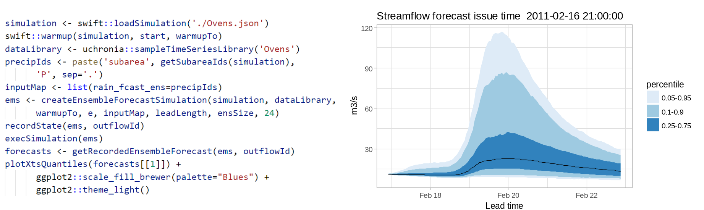
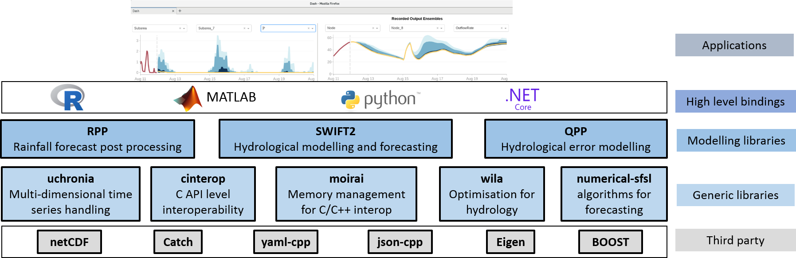

# Onboarding guide for streamflow forecasting software tools

This repository is a public entry point for people interested in a suite of hydrologic ensemble forecasting modelling tools previously referred to as `SWIFT2`. While featuring unique features ensemble streamflow forecasting, they can be used for other semi-distributed hydrologic modelling.




## Capabilities

This documentation introduces a set of software tools for ensemble streamflow forecasting techniques. The core is written in C++, but in practice users access the features via packages in R, python, or Matlab. Hands-on hydrologic modellers can browse through some [sample modelling workflows in R package vignettes](./doc/sample_workflows.md) to get an idea of the features.

An overview of the tools is available [there](https://www.csiro.au/en/Research/LWF/Areas/Water-resources/Assessing-water-resources/WIRADA/Data-and-tools), under the section "Flood and short-term streamflow forecasting". 

A high level description of the software stack with the main components follows.



## Installation

As of April 2018 most of the software tools are not publicly available; you should have received a link to downloadable packages and files. Follow the instructions for your platform

* [Installing on Window](./doc/install_windows.md)
* [Installing on Linux](./doc/install_linux.md)

## Getting started

In R you can access samples via vignettes in the packages:

```R
library(swift)
library(uchronia)
browseVignettes('swift')
```

You can access the wider package documentation using the command `?swift`, and navigate down the page to the footer `[Package swift version 0.7.7 Index]` (yes, admitedly there should be an easier way...). Click on the `Index` hyperlink of that footer. Note that you will find a very long list of functions but functions postfixed `_R` should not be used as primary building blocks in your scripts.

## Troubleshooting

## FAQ

## Acknowledgements

Most of the tools covered by this documentation is the output of research supported by the Water Information Research and Development Alliance between CSIRO and the Australian Bureau of Meteorology.

## Publications

[SWIFT2: High performance software for short-medium term ensemble streamflow forecasting research and operations](https://www.mssanz.org.au/modsim2015/L15/perraud.pdf)

[SWIFT2: Advanced software for continuous ensemble short-term streamflow forecasting ](https://search.informit.com.au/documentSummary;dn=823693257390059;res=IELENG)

