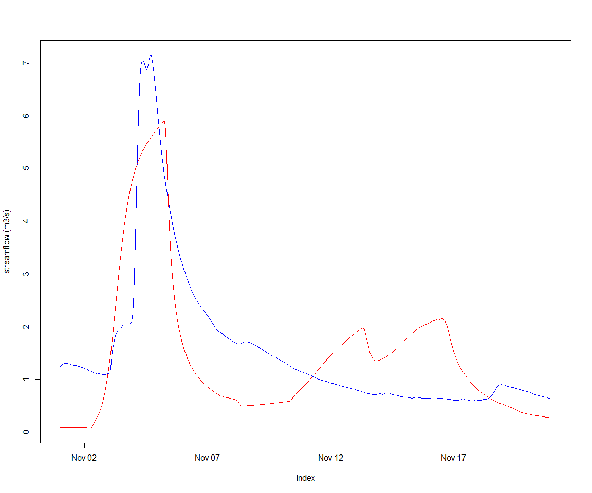

Calibration of subcatchments defined by multiple gauges in a catchment
================
Jean-Michel Perraud
2020-01-28

# Calibration of subcatchments defined by multiple gauges in a catchment

# Use case

This vignette demonstrates how one can calibrate a catchment using
multiple gauging points available within this catchment. Instead of
setting up a whole-of-catchment calibration definition, it makes sense,
at least in a system where subareas above a gauge points do not have a
behavior dependent on other catchment processes (meaning mostly, no
managed reservoirs). SWIFT offers capabilities to calibrate such
subcatchments sequentially, feeding the input flow of upstream and
already calibrated subcatchments to other subcatchments, thus cutting
down on the complexity and runtime of the overall catchment calibration.

# Data

The sample data that comes with the package contains a model definition
for the South Esk catchment, including a short subset of the climate and
flow record data.

``` r
library(swift)
library(DiagrammeR)

modelId <- 'GR4J'
siteId <- 'South_Esk'
simulation <- sampleCatchmentModel(siteId=siteId, configId='catchment')
# simulation <- swapModel(simulation, 'MuskingumNonLinear', 'channel_routing')
simulation <- swapModel(simulation, 'LagAndRoute', 'channel_routing')
```

A visual of the catchment structure (note: may not render yet through
GitHub)

``` r
DiagrammeR(getCatchmentDotGraph(simulation))
```

<!--html_preserve-->

<div id="htmlwidget-deb01b2338456dbeda6b" class="DiagrammeR html-widget" style="width:1152px;height:960px;">

</div>

<script type="application/json" data-for="htmlwidget-deb01b2338456dbeda6b">{"x":{"diagram":"graph TD;1_s(Subarea_1)-->1_l(Subarea_1);2_s(Subarea_2)-->2_l(Subarea_2);3_s(Subarea_3)-->3_l(Subarea_3);4_s(Subarea_4)-->4_l(Subarea_4);5_s(Subarea_5)-->5_l(Subarea_5);6_s(Subarea_6)-->6_l(Subarea_6);7_s(Subarea_7)-->7_l(Subarea_7);8_s(Subarea_8)-->8_l(Subarea_8);9_s(Subarea_9)-->9_l(Subarea_9);10_s(Subarea_10)-->10_l(Subarea_10);11_s(Subarea_11)-->11_l(Subarea_11);12_s(Subarea_12)-->12_l(Subarea_12);13_s(Subarea_13)-->13_l(Subarea_13);14_s(Subarea_14)-->14_l(Subarea_14);15_s(Subarea_15)-->15_l(Subarea_15);16_s(Subarea_16)-->16_l(Subarea_16);17_s(Subarea_17)-->17_l(Subarea_17);18_s(Subarea_18)-->18_l(Subarea_18);19_s(Subarea_19)-->19_l(Subarea_19);20_s(Subarea_20)-->20_l(Subarea_20);21_s(Subarea_21)-->21_l(Subarea_21);22_s(Subarea_22)-->22_l(Subarea_22);23_s(Subarea_23)-->23_l(Subarea_23);24_s(Subarea_24)-->24_l(Subarea_24);25_s(Subarea_25)-->25_l(Subarea_25);26_s(Subarea_26)-->26_l(Subarea_26);27_s(Subarea_27)-->27_l(Subarea_27);28_s(Subarea_28)-->28_l(Subarea_28);29_s(Subarea_29)-->29_l(Subarea_29);30_s(Subarea_30)-->30_l(Subarea_30);31_s(Subarea_31)-->31_l(Subarea_31);32_s(Subarea_32)-->32_l(Subarea_32);33_s(Subarea_33)-->33_l(Subarea_33);34_s(Subarea_34)-->34_l(Subarea_34);35_s(Subarea_35)-->35_l(Subarea_35);36_s(Subarea_36)-->36_l(Subarea_36);37_s(Subarea_37)-->37_l(Subarea_37);38_s(Subarea_38)-->38_l(Subarea_38);39_s(Subarea_39)-->39_l(Subarea_39);40_s(Subarea_40)-->40_l(Subarea_40);41_s(Subarea_41)-->41_l(Subarea_41);42_s(Subarea_42)-->42_l(Subarea_42);\n1_n[Node_1]-->1_l;1_l-->2_n[Node_2];2_n[Node_2]-->2_l;2_l-->5_n[Node_5];3_n[Node_3]-->3_l;3_l-->4_n[Node_4];4_n[Node_4]-->4_l;4_l-->5_n[Node_5];5_n[Node_5]-->5_l;5_l-->7_n[Node_7];6_n[Node_6]-->6_l;6_l-->7_n[Node_7];7_n[Node_7]-->7_l;7_l-->8_n[Node_8];8_n[Node_8]-->8_l;8_l-->9_n[Node_9];9_n[Node_9]-->9_l;9_l-->13_n[Node_13];10_n[Node_10]-->10_l;10_l-->11_n[Node_11];11_n[Node_11]-->11_l;11_l-->12_n[Node_12];12_n[Node_12]-->12_l;12_l-->13_n[Node_13];13_n[Node_13]-->13_l;13_l-->14_n[Node_14];14_n[Node_14]-->14_l;14_l-->15_n[Node_15];15_n[Node_15]-->15_l;15_l-->16_n[Node_16];16_n[Node_16]-->16_l;16_l-->18_n[Node_18];17_n[Node_17]-->17_l;17_l-->18_n[Node_18];18_n[Node_18]-->18_l;18_l-->26_n[Node_26];19_n[Node_19]-->19_l;19_l-->20_n[Node_20];20_n[Node_20]-->20_l;20_l-->21_n[Node_21];21_n[Node_21]-->21_l;21_l-->22_n[Node_22];22_n[Node_22]-->22_l;22_l-->23_n[Node_23];23_n[Node_23]-->23_l;23_l-->24_n[Node_24];24_n[Node_24]-->24_l;24_l-->25_n[Node_25];25_n[Node_25]-->25_l;25_l-->26_n[Node_26];26_n[Node_26]-->26_l;26_l-->29_n[Node_29];27_n[Node_27]-->27_l;27_l-->28_n[Node_28];28_n[Node_28]-->28_l;28_l-->29_n[Node_29];29_n[Node_29]-->29_l;29_l-->30_n[Node_30];30_n[Node_30]-->30_l;30_l-->34_n[Node_34];31_n[Node_31]-->31_l;31_l-->32_n[Node_32];32_n[Node_32]-->32_l;32_l-->33_n[Node_33];33_n[Node_33]-->33_l;33_l-->34_n[Node_34];34_n[Node_34]-->34_l;34_l-->35_n[Node_35];35_n[Node_35]-->35_l;35_l-->36_n[Node_36];36_n[Node_36]-->36_l;36_l-->41_n[Node_41];37_n[Node_37]-->37_l;37_l-->38_n[Node_38];38_n[Node_38]-->38_l;38_l-->39_n[Node_39];39_n[Node_39]-->39_l;39_l-->40_n[Node_40];40_n[Node_40]-->40_l;40_l-->41_n[Node_41];41_n[Node_41]-->41_l;41_l-->42_n[Node_42];42_n[Node_42]-->42_l;42_l-->43_n[Outlet];\nstyle 1_s fill : #A2EB86 ;style 2_s fill : #A2EB86 ;style 3_s fill : #A2EB86 ;style 4_s fill : #A2EB86 ;style 5_s fill : #A2EB86 ;style 6_s fill : #A2EB86 ;style 7_s fill : #A2EB86 ;style 8_s fill : #A2EB86 ;style 9_s fill : #A2EB86 ;style 10_s fill : #A2EB86 ;style 11_s fill : #A2EB86 ;style 12_s fill : #A2EB86 ;style 13_s fill : #A2EB86 ;style 14_s fill : #A2EB86 ;style 15_s fill : #A2EB86 ;style 16_s fill : #A2EB86 ;style 17_s fill : #A2EB86 ;style 18_s fill : #A2EB86 ;style 19_s fill : #A2EB86 ;style 20_s fill : #A2EB86 ;style 21_s fill : #A2EB86 ;style 22_s fill : #A2EB86 ;style 23_s fill : #A2EB86 ;style 24_s fill : #A2EB86 ;style 25_s fill : #A2EB86 ;style 26_s fill : #A2EB86 ;style 27_s fill : #A2EB86 ;style 28_s fill : #A2EB86 ;style 29_s fill : #A2EB86 ;style 30_s fill : #A2EB86 ;style 31_s fill : #A2EB86 ;style 32_s fill : #A2EB86 ;style 33_s fill : #A2EB86 ;style 34_s fill : #A2EB86 ;style 35_s fill : #A2EB86 ;style 36_s fill : #A2EB86 ;style 37_s fill : #A2EB86 ;style 38_s fill : #A2EB86 ;style 39_s fill : #A2EB86 ;style 40_s fill : #A2EB86 ;style 41_s fill : #A2EB86 ;style 42_s fill : #A2EB86 ;\nstyle 1_l fill : #FFF289 ;style 2_l fill : #FFF289 ;style 3_l fill : #FFF289 ;style 4_l fill : #FFF289 ;style 5_l fill : #FFF289 ;style 6_l fill : #FFF289 ;style 7_l fill : #FFF289 ;style 8_l fill : #FFF289 ;style 9_l fill : #FFF289 ;style 10_l fill : #FFF289 ;style 11_l fill : #FFF289 ;style 12_l fill : #FFF289 ;style 13_l fill : #FFF289 ;style 14_l fill : #FFF289 ;style 15_l fill : #FFF289 ;style 16_l fill : #FFF289 ;style 17_l fill : #FFF289 ;style 18_l fill : #FFF289 ;style 19_l fill : #FFF289 ;style 20_l fill : #FFF289 ;style 21_l fill : #FFF289 ;style 22_l fill : #FFF289 ;style 23_l fill : #FFF289 ;style 24_l fill : #FFF289 ;style 25_l fill : #FFF289 ;style 26_l fill : #FFF289 ;style 27_l fill : #FFF289 ;style 28_l fill : #FFF289 ;style 29_l fill : #FFF289 ;style 30_l fill : #FFF289 ;style 31_l fill : #FFF289 ;style 32_l fill : #FFF289 ;style 33_l fill : #FFF289 ;style 34_l fill : #FFF289 ;style 35_l fill : #FFF289 ;style 36_l fill : #FFF289 ;style 37_l fill : #FFF289 ;style 38_l fill : #FFF289 ;style 39_l fill : #FFF289 ;style 40_l fill : #FFF289 ;style 41_l fill : #FFF289 ;style 42_l fill : #FFF289 ;\nstyle 1_n fill : #FFA070 ;style 2_n fill : #FFA070 ;style 3_n fill : #FFA070 ;style 4_n fill : #FFA070 ;style 5_n fill : #FFA070 ;style 6_n fill : #FFA070 ;style 7_n fill : #FFA070 ;style 8_n fill : #FFA070 ;style 9_n fill : #FFA070 ;style 10_n fill : #FFA070 ;style 11_n fill : #FFA070 ;style 12_n fill : #FFA070 ;style 13_n fill : #FFA070 ;style 14_n fill : #FFA070 ;style 15_n fill : #FFA070 ;style 16_n fill : #FFA070 ;style 17_n fill : #FFA070 ;style 18_n fill : #FFA070 ;style 19_n fill : #FFA070 ;style 20_n fill : #FFA070 ;style 21_n fill : #FFA070 ;style 22_n fill : #FFA070 ;style 23_n fill : #FFA070 ;style 24_n fill : #FFA070 ;style 25_n fill : #FFA070 ;style 26_n fill : #FFA070 ;style 27_n fill : #FFA070 ;style 28_n fill : #FFA070 ;style 29_n fill : #FFA070 ;style 30_n fill : #FFA070 ;style 31_n fill : #FFA070 ;style 32_n fill : #FFA070 ;style 33_n fill : #FFA070 ;style 34_n fill : #FFA070 ;style 35_n fill : #FFA070 ;style 36_n fill : #FFA070 ;style 37_n fill : #FFA070 ;style 38_n fill : #FFA070 ;style 39_n fill : #FFA070 ;style 40_n fill : #FFA070 ;style 41_n fill : #FFA070 ;style 42_n fill : #FFA070 ;style 43_n fill : #FFA070 ;"},"evals":[],"jsHooks":[]}</script>

<!--/html_preserve-->

``` r
seClimate <- sampleSeries(siteId=siteId, varName='climate')
seFlows <- sampleSeries(siteId=siteId, varName='flow')
```

The names of the climate series is already set to the climate input
identifiers of the model simulation, so setting them as inputs is easy:

``` r
playInput(simulation, seClimate)
setSimulationSpan(simulation, start(seClimate), end(seClimate))
setSimulationTimeStep(simulation, 'hourly')
```

Moving on to define the parameters, free or fixed. We will use (for now
- may change) the package calibragem, companion to SWIFT.

``` r
configureHourlyGr4j(simulation)
```

We define a function creating a realistic feasible parameter space. This
is not the main object of this vignette, so we do not describe in
details.

``` r
createMetaParameterizer <- function(simulation, refArea=250, timeSpan=3600L) {
  timeSpan <- as.integer(timeSpan)
  parameterizer <- defineGr4jScaledParameter(refArea, timeSpan)
  
  # Let's define _S0_ and _R0_ parameters such that for each GR4J model instance, _S = S0 * x1_ and _R = R0 * x3_
  pStates <- linearParameterizer(
                      paramName=c("S0","R0"), 
                      stateName=c("S","R"), 
                      scalingVarName=c("x1","x3"),
                      minPval=c(0.0,0.0), 
                      maxPval=c(1.0,1.0), 
                      value=c(0.9,0.9), 
                      selectorType='each subarea')
  
  initParameterizer <- makeStateInitParameterizer(pStates)
  parameterizer <- concatenateParameterizers(parameterizer, initParameterizer)
  
  lagAndRouteParameterizer <- function() {
    p <- data.frame(Name = c('alpha', 'inverse_velocity'),
        Value = c(1, 1),
        Min = c(1e-3, 1e-3),
        Max = c(1e2, 1e2),
        stringsAsFactors = FALSE)
    p <- createParameterizer('Generic links', p)
    return(p)
  }

  # Lag and route has several discrete storage type modes. One way to set up the modeP
  setupStorageType <- function(simulation) {
    p <- data.frame(Name = c('storage_type'), 
        Value = 1, 
        Min = 1,
        Max = 1,
        stringsAsFactors = FALSE)
    p <- createParameterizer('Generic links', p)
    applySysConfig(p, simulation)
  }
  setupStorageType(simulation)

  # transfer reach lengths to the Lag and route model
  linkIds <- getLinkIds(simulation)
  reachLengths <- getStateValue(simulation, paste0('link.', linkIds, '.Length'))
  setStateValue(simulation, paste0('link.', linkIds, '.reach_length'), reachLengths) 

  lnrp <- lagAndRouteParameterizer()
  parameterizer <- concatenateParameterizers(parameterizer, lnrp)  
  return(parameterizer)
}
```

``` r
parameterizer <- createMetaParameterizer(simulation)
parameterizerAsDataFrame(parameterizer)
```

    ##               Name       Min        Max     Value
    ## 1           log_x4  0.000000   2.380211 0.3054223
    ## 2           log_x1  0.000000   3.778151 0.5066903
    ## 3           log_x3  0.000000   3.000000 0.3154245
    ## 4         asinh_x2 -3.989327   3.989327 2.6377523
    ## 5               R0  0.000000   1.000000 0.9000000
    ## 6               S0  0.000000   1.000000 0.9000000
    ## 7            alpha  0.001000 100.000000 1.0000000
    ## 8 inverse_velocity  0.001000 100.000000 1.0000000

Now, checking that a default parameter set works structurally on the
simulation:

``` r
setParameterValue(parameterizer, 'asinh_x2', 0)
applySysConfig(parameterizer, simulation)
execSimulation(simulation)
```

We are now ready to enter the main topic of this vignette, subsetting
the catchment into subcatchments for calibration purposes.

The sample gauge data flow contains identifiers that are of course
distinct from the network node identifiers. We create a map between them
(note - this information used to be in the NodeLink file in swiftv1),
and we use these node as splitting points to derive subcatchments

``` r
gauges <- as.character(c( 92106, 592002, 18311, 93044,    25,   181))
names(gauges) <- paste0('node.', as.character( c(7,   12,   25,   30,   40,   43) ))   
splitElementIds <- names(gauges)
subCats <- splitToSubcatchments(simulation, splitElementIds)
str(subCats)
```

    ## List of 6
    ##  $ node.40:Formal class 'ExternalObjRef' [package "cinterop"] with 2 slots
    ##   .. ..@ obj :<externalptr> 
    ##   .. ..@ type: chr "MODEL_SIMULATION_PTR"
    ##  $ node.25:Formal class 'ExternalObjRef' [package "cinterop"] with 2 slots
    ##   .. ..@ obj :<externalptr> 
    ##   .. ..@ type: chr "MODEL_SIMULATION_PTR"
    ##  $ node.12:Formal class 'ExternalObjRef' [package "cinterop"] with 2 slots
    ##   .. ..@ obj :<externalptr> 
    ##   .. ..@ type: chr "MODEL_SIMULATION_PTR"
    ##  $ node.7 :Formal class 'ExternalObjRef' [package "cinterop"] with 2 slots
    ##   .. ..@ obj :<externalptr> 
    ##   .. ..@ type: chr "MODEL_SIMULATION_PTR"
    ##  $ node.30:Formal class 'ExternalObjRef' [package "cinterop"] with 2 slots
    ##   .. ..@ obj :<externalptr> 
    ##   .. ..@ type: chr "MODEL_SIMULATION_PTR"
    ##  $ node.43:Formal class 'ExternalObjRef' [package "cinterop"] with 2 slots
    ##   .. ..@ obj :<externalptr> 
    ##   .. ..@ type: chr "MODEL_SIMULATION_PTR"

The resulting list of subcatchment simulations is already ordered in an
upstream to downstream order by SWIFT.

If we are to set up the first step of the sequential calibration:

``` r
elementId <- names(subCats)[1]

gaugeId <- gauges[elementId]
gaugeFlow <- seFlows[,gaugeId]
sc <- subCats[[elementId]]
applySysConfig(parameterizer,sc)
varId <- 'Catchment.StreamflowRate'
recordState(sc,varId)
```

``` r
DiagrammeR(getCatchmentDotGraph(sc))
```

<!--html_preserve-->

<div id="htmlwidget-aefe520489535f2cfbdb" class="DiagrammeR html-widget" style="width:1152px;height:960px;">

</div>

<script type="application/json" data-for="htmlwidget-aefe520489535f2cfbdb">{"x":{"diagram":"graph TD;37_s(Subarea_37)-->37_l(Subarea_37);38_s(Subarea_38)-->38_l(Subarea_38);39_s(Subarea_39)-->39_l(Subarea_39);\n39_n[Node_39]-->39_l;39_l-->40_n[Node_40];38_n[Node_38]-->38_l;38_l-->39_n[Node_39];37_n[Node_37]-->37_l;37_l-->38_n[Node_38];\nstyle 37_s fill : #A2EB86 ;style 38_s fill : #A2EB86 ;style 39_s fill : #A2EB86 ;\nstyle 39_l fill : #FFF289 ;style 38_l fill : #FFF289 ;style 37_l fill : #FFF289 ;\nstyle 40_n fill : #FFA070 ;style 39_n fill : #FFA070 ;style 38_n fill : #FFA070 ;style 37_n fill : #FFA070 ;"},"evals":[],"jsHooks":[]}</script>

<!--/html_preserve-->

Let’s view the default, uncalibrated output

``` r
obsVsCalc <- function(obs, calc, ylab="streamflow (m3/s)") {
    joki::plotTwoSeries(obs, calc, ylab=ylab, startTime = start(obs), endTime = end(obs))
}
```

``` r
execSimulation(sc)
obsVsCalc(gaugeFlow, getRecorded(sc, varId))
```


Now, setting up an objective (NSE) and optimizer:

``` r
objectiveId <- 'NSE'
objective <- createObjective(sc, varId, observation=gaugeFlow, objectiveId, start(seFlows), end(seFlows))
score <- getScore(objective,parameterizer)  
```

``` r
termination <- getMarginalTermination( tolerance = 1e-04, cutoffNoImprovement = 30, maxHours = 2/60) 
termination <- swift::CreateSceTerminationWila_Pkg_R('relative standard deviation', c('0.05','0.0167'))
sceParams <- getDefaultSceParameters()
params <- parameterizerAsDataFrame(parameterizer)
npars <- length(which(abs(params$Max-params$Min)>0))
sceParams <- SCEParameters(npars)
optimizer <- createSceOptimSwift(objective,terminationCriterion = termination, populationInitializer = parameterizer,SCEpars = sceParams)
calibLogger <- setCalibrationLogger(optimizer,"dummy")

optimStartTime <- lubridate::now();
calibResults <- executeOptimization(optimizer)
optimEndTime <- lubridate::now();
optimWallClock <- lubridate::as.duration(lubridate::interval(optimStartTime, optimEndTime))

optimWallClock
```

    ## [1] "11.4364669322968s"

And the resulting hydrograph follows. The NSE score is decent, but the
magnitude of the peak is not well represented. We used a uniform value
for the routing parameters; having a scaling based on link properties
may be a line of enquiry.

``` r
sortedResults <- sortByScore(calibResults, 'NSE')
head(scoresAsDataFrame(sortedResults))
```

    ##         NSE   log_x4    log_x1    log_x3  asinh_x2        R0        S0
    ## 1 0.4949697 2.082811 0.8537391 0.5311710 0.2138180 0.2610210 0.3526996
    ## 2 0.4949311 2.089526 0.8630253 0.5096557 0.2259685 0.1997594 0.3133773
    ## 3 0.4947418 2.080529 0.8402662 0.5453678 0.2241863 0.2453242 0.2806822
    ## 4 0.4947411 2.087740 0.8549421 0.4918872 0.2107718 0.2001515 0.3279347
    ## 5 0.4947155 2.082976 0.8540680 0.5326692 0.2326300 0.3102163 0.3848358
    ## 6 0.4947014 2.099333 0.8598832 0.4789433 0.1990987 0.2159813 0.3402485
    ##      alpha inverse_velocity
    ## 1 57.43339         44.65305
    ## 2 50.28133         52.15916
    ## 3 54.01892         47.18598
    ## 4 63.34453         52.55784
    ## 5 63.39566         46.43670
    ## 6 57.53490         50.23801

``` r
p <- swift::getScoreAtIndex(sortedResults, 1)
p <- GetSystemConfigurationWila_R(p)
parameterizerAsDataFrame(p)
```

    ##               Name       Min        Max      Value
    ## 1           log_x4  0.000000   2.380211  2.0828106
    ## 2           log_x1  0.000000   3.778151  0.8537391
    ## 3           log_x3  0.000000   3.000000  0.5311710
    ## 4         asinh_x2 -3.989327   3.989327  0.2138180
    ## 5               R0  0.000000   1.000000  0.2610210
    ## 6               S0  0.000000   1.000000  0.3526996
    ## 7            alpha  0.001000 100.000000 57.4333924
    ## 8 inverse_velocity  0.001000 100.000000 44.6530483

``` r
applySysConfig(p, sc)
execSimulation(sc)
obsVsCalc(gaugeFlow, getRecorded(sc, varId))
```



We can create a subcatchment parameterizer, such that when applied to
the whole of the South Esk, only the states of the subareas, links and
nodes of the subcatchment are potentially affected.

``` r
sp <- subcatchmentParameterizer(p, sc)
applySysConfig(sp, simulation)
getStateValue(simulation, paste0('subarea.', 34:40, '.x2'))
```

    ## subarea.34.x2 subarea.35.x2 subarea.36.x2 subarea.37.x2 subarea.38.x2 
    ##     0.0000000     0.0000000     0.0000000     0.1443521     0.1443521 
    ## subarea.39.x2 subarea.40.x2 
    ##     0.1443521     0.0000000

``` r
# saIds <- getSubareaIds(simulation)

spFile <- tempfile()
SaveParameterizer_R(sp, spFile)
# as of May 2016, cannot reload this on Linux. There is an issue leading to a segfault, possibly related to having added support nan, inf as numeric values.
# as of July 2016, this works on Windows however. Try and see.
sp2 <- LoadParameterizer_R(spFile)

if(file.exists(spFile)) { file.remove(spFile) }
```

    ## [1] TRUE

## Whole of catchment calibration combining point gauges

``` r
gauges <- as.character(c( 92106, 592002, 18311, 93044,    25,   181))
names(gauges) <- paste0('node.', as.character( c(7,   12,   25,   30,   40,   43) ))
calibNodes <- paste0('node.', as.character( c(7,   12) ))

elementId <- names(subCats)[1]

gaugeId <- gauges[calibNodes]
gaugeFlow <- seFlows[,gaugeId]

varId <- paste0(calibNodes, '.OutflowRate')
recordState(simulation,varId)
```

``` r
objectiveId <- 'NSE'
objective <- createObjective(simulation, varId[1], observation=gaugeFlow[,1], objectiveId, start(seFlows), end(seFlows))

addToCompositeObjective <- function(compositeObj, objective, weight, name) {
  obj <- objective
  if (cinterop::isExternalObjRef(objective, 'OBJECTIVE_EVALUATOR_WILA_PTR')) {
    obj <- UnwrapObjectiveEvaluatorWila_R(objective)
  }
  AddSingleObservationObjectiveEvaluator_R(compositeObj, obj, weight, name)
}

co <- CreateEmptyCompositeObjectiveEvaluator_R()
addToCompositeObjective(co, objective, 1.0, varId[1])
objective <- createObjective(simulation, varId[2], observation=gaugeFlow[,2], objectiveId, start(seFlows), end(seFlows))
addToCompositeObjective(co, objective, 1.0, varId[2])

co <- swift::WrapObjectiveEvaluatorWila_R(co, clone=TRUE)

score <- getScore(co,parameterizer) 
# scoresAsDataFrame(score)
```
