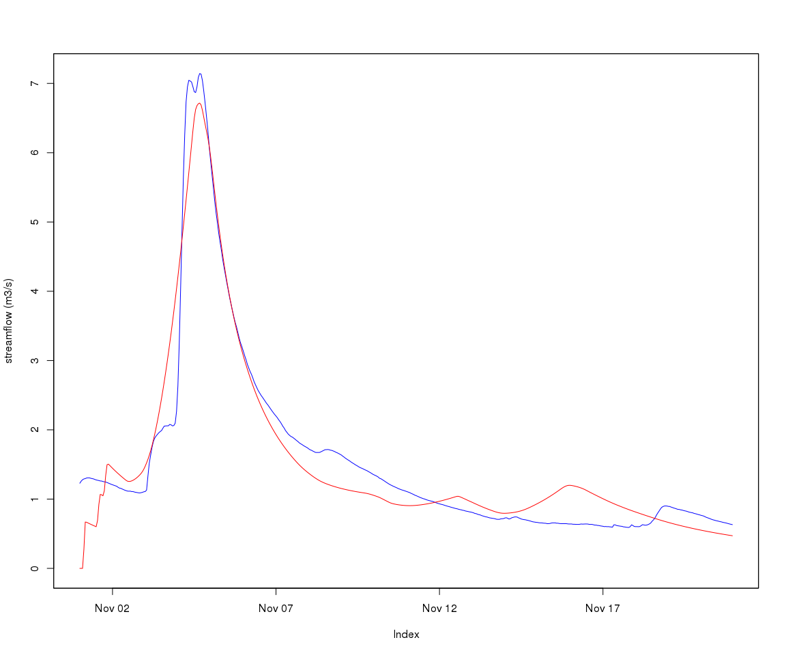

Calibration of subcatchments defined by multiple gauges in a catchment
================
Jean-Michel Perraud
2018-04-13

Calibration of subcatchments defined by multiple gauges in a catchment
======================================================================

Use case
========

This vignette demonstrates how one can calibrate a catchment using multiple gauging points available within this catchment. Instead of setting up a whole-of-catchment calibration definition, it makes sense, at least in a system where subareas above a gauge points do not have a behavior dependent on other catchment processes (meaning mostly, no managed reservoirs). SWIFT offers capabilities to calibrate such subcatchments sequentially, feeding the input flow of upstream and already calibrated subcatchments to other subcatchments, thus cutting down on the complexity and runtime of the overall catchment calibration.

Data
====

The sample data that comes with the package contains a model definition for the South Esk catchment, including a short subset of the climate and flow record data.

``` r
library(swift)

modelId <- 'GR4J'
siteId <- 'South_Esk'
simulation <- sampleCatchmentModel(siteId=siteId, configId='catchment')
# simulation <- swapModel(simulation, 'MuskingumNonLinear', 'channel_routing')
simulation <- swapModel(simulation, 'LagAndRoute', 'channel_routing')


seClimate <- sampleSeries(siteId=siteId, varName='climate')
seFlows <- sampleSeries(siteId=siteId, varName='flow')
```

The names of the climate series is already set to the climate input identifiers of the model simulation, so setting them as inputs is easy:

``` r
playInput(simulation, seClimate)
setSimulationSpan(simulation, start(seClimate), end(seClimate))
setSimulationTimeStep(simulation, 'hourly')
```

Moving on to define the parameters, free or fixed. We will use (for now - may change) the package calibragem, companion to SWIFT.

``` r
configureHourlyGr4j(simulation)
```

We define a function creating a realistic feasible parameter space. This is not the main object of this vignette, so we do not describe in details.

``` r
pfunc <- function(simulation) {
  deltaT <- 1L
  refArea <- 250
  timeSpan <- 3600L

  timeSpan <- as.integer(timeSpan)
  parameterizer <- defineGr4jScaledParameter(refArea, timeSpan)
  
  # Let's define _S0_ and _R0_ parameters such that for each GR4J model instance, _S = S0 * x1_ and _R = R0 * x3_
  pStates <- linearParameterizer(
                      c("S0","R0"), 
                      c("S","R"), 
                      c("x1","x3"),
                      c(0.0,0.0), 
                      c(1.0,1.0), 
                      c(0.9,0.9), 
                      'each subarea')
  
  initParameterizer <- makeStateInitParameterizer(pStates)
  parameterizer <- concatenateParameterizers(parameterizer, initParameterizer)
  
  lagAndRouteParameterizer <- function() {
    p <- data.frame(Name = c('alpha', 'inverse_velocity'),
        Value = c(1, 1),
        Min = c(1e-3, 1e-3),
        Max = c(1e2, 1e2),
        stringsAsFactors = FALSE)
    p <- createParameterizer('Generic links', p)
    return(p)
  }
  
  setupStorageType <- function(simulation) {
    p <- data.frame(Name = c('storage_type'), 
        Value = 1, 
        Min = 1,
        Max = 1,
        stringsAsFactors = FALSE)
    p <- createParameterizer('Generic links', p)
    applySysConfig(p, simulation)
  }

  setupStorageType(simulation)
  # transfer reach lengths to the Lag and route model
  linkIds <- getLinkIds(simulation)
  reachLengths <- getStateValue(simulation, paste0('link.', linkIds, '.Length'))
  setStateValue(simulation, paste0('link.', linkIds, '.reach_length'), reachLengths) 

  lnrp <- lagAndRouteParameterizer()
  parameterizer <- concatenateParameterizers(parameterizer, lnrp)  
  return(parameterizer)
}
```

Now, checking that a default parameter set works structurally on the simulation:

``` r
parameterizer <- pfunc(simulation)
parameterizerAsDataFrame(parameterizer)
```

    ##               Name       Min        Max     Value
    ## 1           log_x4  0.000000   2.380211 0.3054223
    ## 2           log_x1  0.000000   3.778151 0.5066903
    ## 3           log_x3  0.000000   3.000000 0.3154245
    ## 4         asinh_x2 -3.989327   3.989327 2.6377523
    ## 5               R0  0.000000   1.000000 0.9000000
    ## 6               S0  0.000000   1.000000 0.9000000
    ## 7            alpha  0.001000 100.000000 1.0000000
    ## 8 inverse_velocity  0.001000 100.000000 1.0000000

``` r
# parameterizerAsDataFrame( backtransform(parameterizer))
applySysConfig(parameterizer, simulation)
execSimulation(simulation)
```

We are now ready to enter the main topic of this vignette, subsetting the catchment into subcatchments for calibration purposes.

The sample gauge data flow contains identifiers that are of course distinct from the network node identifiers. We create a map between them (note - this information used to be in the NodeLink file in swiftv1), and we use these node as splitting points to derive subcatchments

``` r
gauges <- as.character(c( 92106, 592002, 18311, 93044,    25,   181))
names(gauges) <- paste0('node.', as.character( c(7,   12,   25,   30,   40,   43) ))   
splitElementIds <- names(gauges)
subCats <- splitToSubcatchments(simulation, splitElementIds)
str(subCats)
```

    ## List of 7
    ##  $ node.40  :Formal class 'ExternalObjRef' [package "cinterop"] with 2 slots
    ##   .. ..@ obj :<externalptr> 
    ##   .. ..@ type: chr "MODEL_SIMULATION_PTR"
    ##  $ node.25  :Formal class 'ExternalObjRef' [package "cinterop"] with 2 slots
    ##   .. ..@ obj :<externalptr> 
    ##   .. ..@ type: chr "MODEL_SIMULATION_PTR"
    ##  $ node.12  :Formal class 'ExternalObjRef' [package "cinterop"] with 2 slots
    ##   .. ..@ obj :<externalptr> 
    ##   .. ..@ type: chr "MODEL_SIMULATION_PTR"
    ##  $ node.7   :Formal class 'ExternalObjRef' [package "cinterop"] with 2 slots
    ##   .. ..@ obj :<externalptr> 
    ##   .. ..@ type: chr "MODEL_SIMULATION_PTR"
    ##  $ node.30  :Formal class 'ExternalObjRef' [package "cinterop"] with 2 slots
    ##   .. ..@ obj :<externalptr> 
    ##   .. ..@ type: chr "MODEL_SIMULATION_PTR"
    ##  $ node.43  :Formal class 'ExternalObjRef' [package "cinterop"] with 2 slots
    ##   .. ..@ obj :<externalptr> 
    ##   .. ..@ type: chr "MODEL_SIMULATION_PTR"
    ##  $ remainder:Formal class 'ExternalObjRef' [package "cinterop"] with 2 slots
    ##   .. ..@ obj :<externalptr> 
    ##   .. ..@ type: chr "MODEL_SIMULATION_PTR"

The resulting list of subcatchment simulations is already ordered in an upstream to downstream order by SWIFT.

If we are to set up the first step of the sequential calibration:

``` r
elementId <- names(subCats)[1]

gaugeId <- gauges[elementId]
gaugeFlow <- seFlows[,gaugeId]
sc <- subCats[[elementId]]
applySysConfig(parameterizer,sc)
varId <- 'Catchment.StreamflowRate'
recordState(sc,varId)
```

Let's view the default, uncalibrated output

``` r
obsVsCalc <- function(obs, calc, ylab="streamflow (m3/s)") {
    joki::plotTwoSeries(obs, calc, ylab=ylab, startTime = start(obs), endTime = end(obs))
}
```

``` r
execSimulation(sc)
obsVsCalc(gaugeFlow, getRecorded(sc, varId))
```


Now, setting up an objective (NSE) and optimizer:

``` r
objectiveId <- 'NSE'
objective <- createObjective(sc, varId, observation=gaugeFlow, objectiveId, start(seFlows), end(seFlows))
score <- getScore(objective,parameterizer)  
```

``` r
termination <- getMarginalTermination( tolerance = 1e-04, cutoffNoImprovement = 30, maxHours = 2/60) 
sceParams <- getDefaultSceParameters()
params <- parameterizerAsDataFrame(parameterizer)
npars <- length(which(abs(params$Max-params$Min)>0))
sceParams <- SCEParameters(npars)
optimizer <- createSceOptimSwift(objective,terminationCriterion = termination, populationInitializer = parameterizer,SCEpars = sceParams)
calibLogger <- setCalibrationLogger(optimizer,"dummy")

optimStartTime <- lubridate::now();
calibResults <- executeOptimization(optimizer)
optimEndTime <- lubridate::now();
optimWallClock <- lubridate::as.duration(lubridate::interval(optimStartTime, optimEndTime))

optimWallClock
```

    ## [1] "72.7610328197479s (~1.21 minutes)"

And the resulting hydrograph follows. The NSE score is decent, but the magnitude of the peak is not well represented. We used a uniform value for the routing parameters; having a scaling based on link properties may be a line of enquiry.

``` r
sortedResults <- sortByScore(calibResults, 'NSE')
head(scoresAsDataFrame(sortedResults))
```

    ##         NSE   log_x4   log_x1   log_x3  asinh_x2        R0        S0
    ## 1 0.9470951 1.944859 1.421206 1.397714 -1.121580 0.2636940 0.9550961
    ## 2 0.9470951 1.944859 1.421211 1.397715 -1.121591 0.2636938 0.9550962
    ## 3 0.9470951 1.944859 1.421203 1.397716 -1.121591 0.2636937 0.9550992
    ## 4 0.9470951 1.944859 1.421205 1.397715 -1.121584 0.2636939 0.9550971
    ## 5 0.9470951 1.944859 1.421207 1.397716 -1.121594 0.2636939 0.9550981
    ## 6 0.9470951 1.944859 1.421203 1.397716 -1.121583 0.2636940 0.9550977
    ##      alpha inverse_velocity
    ## 1 1.000495         1.788070
    ## 2 1.000497         1.788070
    ## 3 1.000495         1.788071
    ## 4 1.000493         1.788075
    ## 5 1.000492         1.788077
    ## 6 1.000495         1.788070

``` r
p <- swift::getScoreAtIndex(sortedResults, 1)
p <- GetSystemConfigurationWila_R(p)
parameterizerAsDataFrame(p)
```

    ##               Name       Min        Max      Value
    ## 1           log_x4  0.000000   2.380211  1.9448588
    ## 2           log_x1  0.000000   3.778151  1.4212060
    ## 3           log_x3  0.000000   3.000000  1.3977143
    ## 4         asinh_x2 -3.989327   3.989327 -1.1215798
    ## 5               R0  0.000000   1.000000  0.2636940
    ## 6               S0  0.000000   1.000000  0.9550961
    ## 7            alpha  0.001000 100.000000  1.0004946
    ## 8 inverse_velocity  0.001000 100.000000  1.7880698

``` r
applySysConfig(p, sc)
execSimulation(sc)
obsVsCalc(gaugeFlow, getRecorded(sc, varId))
```



We can create a subcatchment parameterizer, such that when applied to the whole of the South Esk, only the states of the subareas, links and nodes of the subcatchment are potentially affected.

``` r
sp <- subcatchmentParameterizer(p, sc)
applySysConfig(sp, simulation)
getStateValue(simulation, paste0('subarea.', 34:40, '.x2'))
```

    ## subarea.34.x2 subarea.35.x2 subarea.36.x2 subarea.37.x2 subarea.38.x2 
    ##     4.6599237     4.6599237     4.6599237    -0.9192182    -0.9192182 
    ## subarea.39.x2 subarea.40.x2 
    ##    -0.9192182     4.6599237

``` r
# saIds <- getSubareaIds(simulation)

spFile <- tempfile()
SaveParameterizer_R(sp, spFile)
# as of May 2016, cannot reload this on Linux. There is an issue leading to a segfault, possibly related to having added support nan, inf as numeric values.
# as of July 2016, this works on Windows however. Try and see.
sp2 <- LoadParameterizer_R(spFile)

if(file.exists(spFile)) { file.remove(spFile) }
```

    ## [1] TRUE
