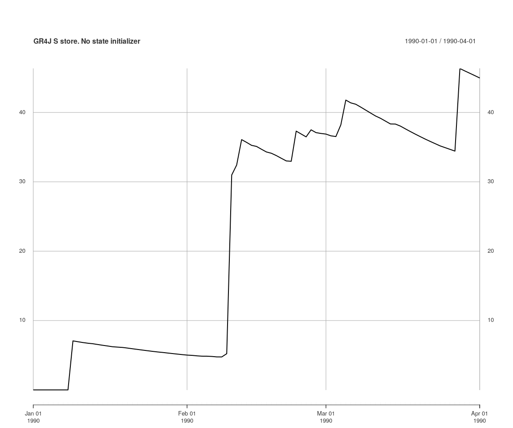
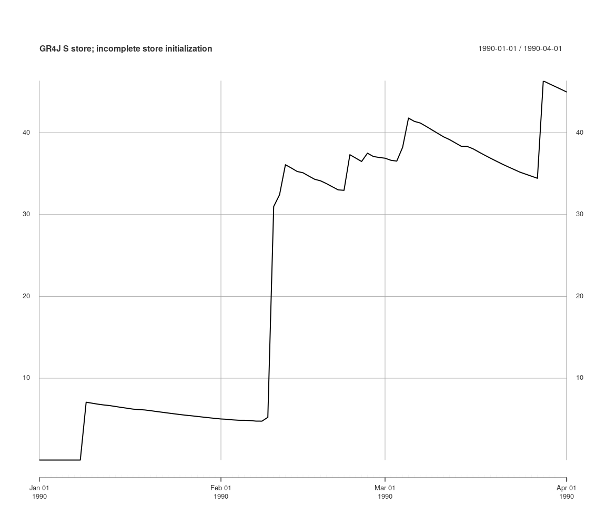
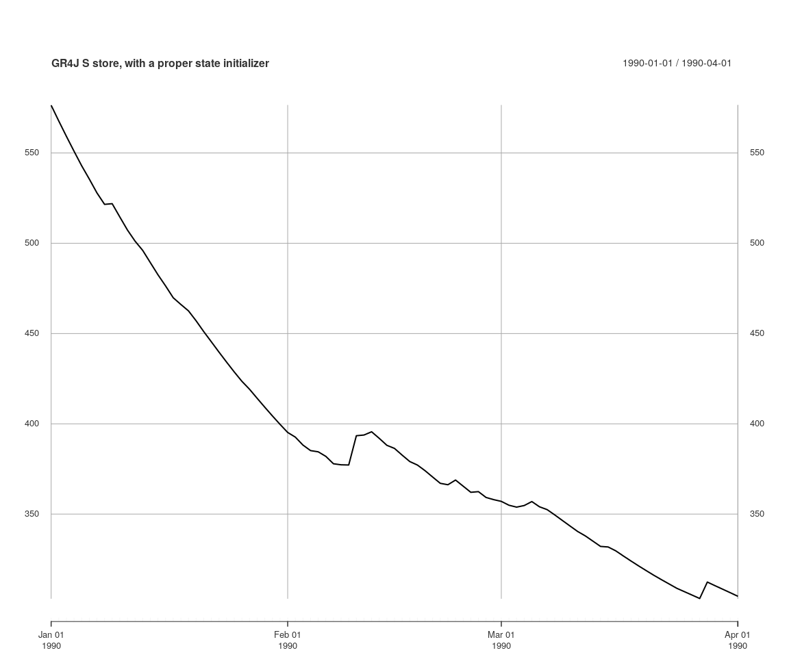

Calibration with initial model memory states as parameters
================
Jean-Michel Perraud
2019-01-17

Calibration with initial model memory states as parameters
==========================================================

About this document
===================

This document was generated from an R markdown file on 2019-01-17 12:17:53. It is a vignette to demonstrate features in SWIFT to calibrate a model with initial model states as a parameter.

Essentials of setting up a calibration of initial states
========================================================

This vignette will illustrate how to define two *meta-parameters*, *S0* and *R0*, controlling the initial level of stores in the GR4J model, as fraction of the store capacities.

We'll load a simple catchment with one subarea only; the feature applies equally to catchment with multiple sub-areas

``` r
library(swift)

modelId <- 'GR4J'
ms <- createSubareaSimulation(dataId='MMH', simulStart='1990-01-01', simulEnd='2005-12-31', 
    modelId=modelId, tstep='daily', varNameRain='P', varNamePet='E')
```

We define a few model state identifiers, and set them to be recorded to time series.

``` r
gr4jModelVars <- runoffModelVarIds(modelId)
print(gr4jModelVars)
```

    ##  [1] "P"          "E"          "runoff"     "S"          "R"         
    ##  [6] "Ps"         "Es"         "Pr"         "ech1"       "ech2"      
    ## [11] "Perc"       "x1"         "x2"         "x3"         "x4"        
    ## [16] "UHExponent" "PercFactor"

``` r
elementId <- 'subarea.Subarea'
mkVarId <- function (shortName) { paste0(elementId, '.', shortName) }
runoffId <- mkVarId('runoff')
sVarId <- mkVarId('S')
rVarId <- mkVarId('R')
recordState(ms, c(runoffId, sVarId, rVarId))
```

We'll set up a short runtime span, so that we illustrate the state initialisation feature.

``` r
obsRunoff <- sampleSeries('MMH', 'flow') #actually, this is a time series of runoff depth, not streamflow rate
obsRunoff[which(obsRunoff < -1)] <- NA
s <- start(obsRunoff)
w <- s
e <- s + lubridate::days(90)
setSimulationSpan(ms, s, e)
```

Let's apply some default model parameters to the model:

``` r
(pSpecGr4j <- joki::getFreeParams(modelId))
```

    ##   Name      Value Min  Max
    ## 1   x1 650.488000   1 3000
    ## 2   x2  -0.280648 -27   27
    ## 3   x3   7.891230   1  660
    ## 4   x4  18.917200   1  240

``` r
pSpecGr4j$Name <- mkVarId(pSpecGr4j$Name)
# TODO : a print function for native parameterizers.
p <- createParameterizer(type='Generic', pSpecGr4j)
parameterizerAsDataFrame(p)
```

    ##                 Name Min  Max      Value
    ## 1 subarea.Subarea.x1   1 3000 650.488000
    ## 2 subarea.Subarea.x2 -27   27  -0.280648
    ## 3 subarea.Subarea.x3   1  660   7.891230
    ## 4 subarea.Subarea.x4   1  240  18.917200

``` r
applySysConfig(p, ms)
```

We get a time series of *S* if we run it at this point; the starting value is zero.

``` r
execSimulation(ms)
plot(getRecorded(ms, sVarId), main='GR4J S store. No state initializer')
```



Let's define *S0* and *R0* parameters such that for each GR4J model instance, *S = S0 \* x1* and *R = R0 \* x3*

``` r
pStates <- linearParameterizer(
                      c("S0","R0"), 
                      c("S","R"), 
                      c("x1","x3"),
                      c(0.0,0.0), 
                      c(1.0,1.0), 
                      c(0.9,0.9), 
                      'each subarea')
```

If one applies this parameterizer *pState* to the system, the the *S* store is set to the expected value relative to *x1*.

``` r
applySysConfig(pStates, ms)
getStateValue(ms, sVarId)
```

    ## subarea.Subarea.S 
    ##          585.4392

**However** this is not enough to define a parameterizer as an initial state. If executing the simulation, the time series of *S* still starts at zero, because the resetting the model overrides the state *S*:

``` r
execSimulation(ms)
plot(getRecorded(ms, sVarId), main='GR4J S store; incomplete store initialization')
```



You need to define a new parameterizer, that makes sure that the model is reset to the expected initial value.

``` r
initParameterizer <- makeStateInitParameterizer(pStates)
applySysConfig(initParameterizer, ms)
execSimulation(ms)
plot(getRecorded(ms, sVarId), main='GR4J S store, with a proper state initializer')
```



There is logic in keeping the two previous steps in defining a parameterizer as separate, hence this present vignette emphasizes the importance of these two steps.

Once you have defined this parameterizer using `{r eval=FALSE} makeStateInitParameterizer`, you can define a calibration objective the usual way. This vignette does not include calibration steps; please refer to other vignettes.

``` r
p <- concatenateParameterizers(p, initParameterizer)
parameterizerAsDataFrame(p)
```

    ##                 Name Min  Max      Value
    ## 1 subarea.Subarea.x1   1 3000 650.488000
    ## 2 subarea.Subarea.x2 -27   27  -0.280648
    ## 3 subarea.Subarea.x3   1  660   7.891230
    ## 4 subarea.Subarea.x4   1  240  18.917200
    ## 5                 R0   0    1   0.900000
    ## 6                 S0   0    1   0.900000

``` r
objective <- createObjective(ms, runoffId, obsRunoff, 'NSE', w, e)
score <- getScore(objective, p)
print(score)
```

    ## $scores
    ##       NSE 
    ## -130.2095 
    ## 
    ## $sysconfig
    ##                 Name Min  Max      Value
    ## 1 subarea.Subarea.x1   1 3000 650.488000
    ## 2 subarea.Subarea.x2 -27   27  -0.280648
    ## 3 subarea.Subarea.x3   1  660   7.891230
    ## 4 subarea.Subarea.x4   1  240  18.917200
    ## 5                 R0   0    1   0.900000
    ## 6                 S0   0    1   0.900000
