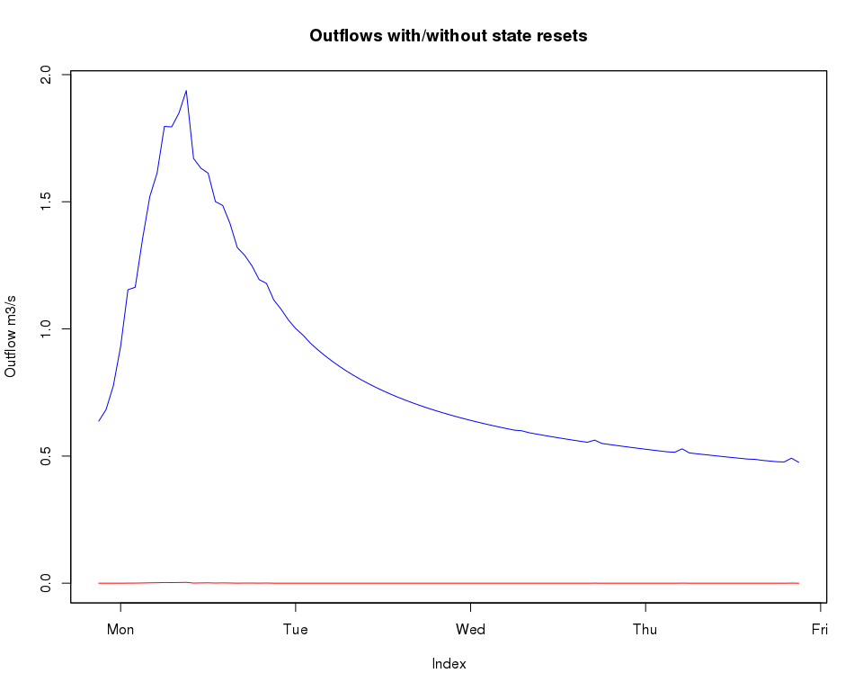
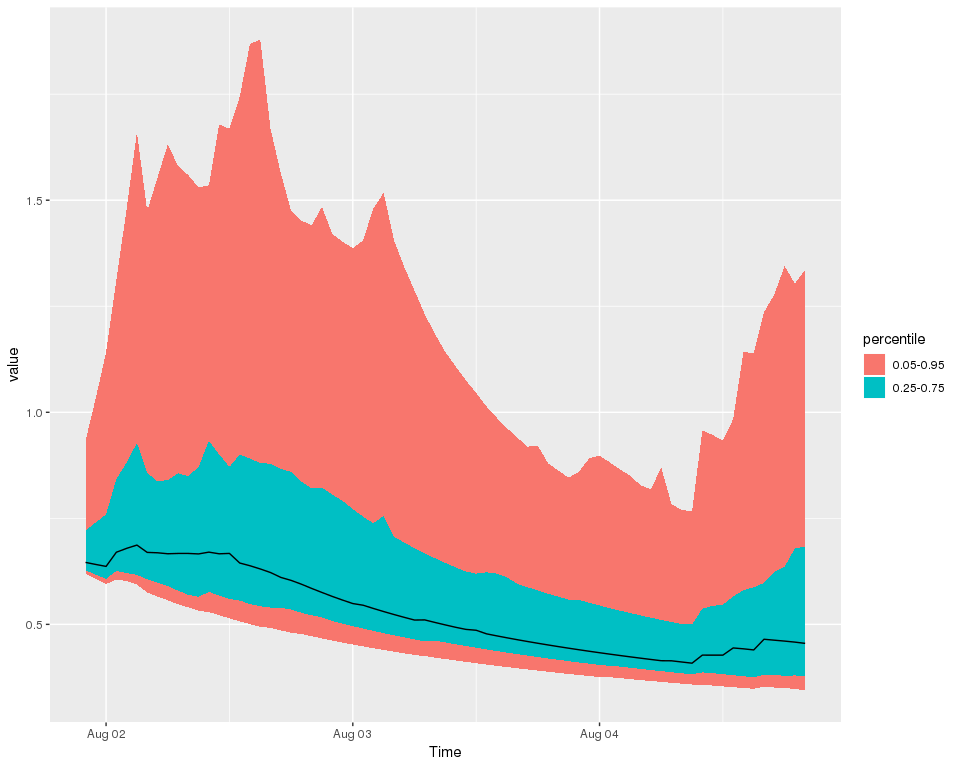

Ensemble SWIFT model runs
================
Jean-Michel Perraud
2018-04-13

Ensemble SWIFT model runs
=========================

About this document
===================

This document was generated from an R markdown file on 2018-04-13 18:24:47.

Elaboration
===========

``` r
library(swift)
```

    ## Loading required package: Rcpp

    ## Warning: replacing previous import 'joki::addLegend' by 'xts::addLegend'
    ## when loading 'swift'

``` r
has_data <- swift::hasSampleData()
```

Let's create a test catchment with a few subareas

``` r
runoffModel='GR4J'

nodeIds=paste0('n', 1:6)
linkIds = paste0('lnk', 1:5)
defn <- list(
    nodeIds=nodeIds,
    nodeNames = paste0(nodeIds, '_name'),
    linkIds=linkIds,
    linkNames = paste0(linkIds, '_name'),
    fromNode = paste0('n', c(2,5,4,3,1)),
    toNode = paste0('n', c(6,2,2,4,4)),
    areasKm2 = c(1.2, 2.3, 4.4, 2.2, 1.5),
    runoffModel = runoffModel
)
simulation <- createCatchment(defn$nodeIds, defn$nodeNames, defn$linkIds, defn$linkNames, defn$fromNode, defn$toNode, defn$runoffModel, defn$areasKm2)
```

the package `uchronia` includes facilities to access time series from a "library", akin to what you would do to manage books.

``` r
dataLibrary <- uchronia::sampleTimeSeriesLibrary('upper murray')
dataIds <- uchronia::GetEnsembleDatasetDataIdentifiers_R(dataLibrary)
print(uchronia::GetEnsembleDatasetDataSummaries_R(dataLibrary))
```

    ## [1] "variable name: pet_der, identifier: 1, start: 1989-12-31T00:00:00, end: 2012-12-30T00:00:00, time length: 8401, time step: daily"                            
    ## [2] "variable name: pet_der, identifier: 1, start: 1988-12-31T00:00:00, end: 2012-12-30T00:00:00, time length: 8766, time step: daily"                            
    ## [3] "variable name: rain_der, identifier: 1, start: 1989-12-31T13:00:00, end: 2012-10-31T12:00:00, time length: 200160, time step: hourly"                        
    ## [4] "variable name: rain_fcast_ens, identifier: 1, index: 0, start: 2010-08-01T21:00:00, end: 2010-08-06T21:00:00, time length: 5, time step: <not yet supported>"

The sample catchment structure is obviously not the real "Upper Murray". For the sake of a didactic example, let's set the same inputs across all the subareas.

``` r
precipIds <- paste( 'subarea', getSubareaIds(simulation), 'P', sep='.')
evapIds <- paste( 'subarea', getSubareaIds(simulation), 'E', sep='.')
playInputs(simulation, dataLibrary, precipIds, rep('rain_obs', length(precipIds)))
playInputs(simulation, dataLibrary, evapIds, rep('pet_obs', length(evapIds)), 'daily_to_hourly')
```

    ## Warning in playInputs(simulation, dataLibrary, evapIds, rep("pet_obs",
    ## length(evapIds)), : Reusing argument `resample` to match the length of
    ## `modelVarId`

``` r
# And the flow rate we will record
outflowId <- 'Catchment.StreamflowRate'
```

Given the information from the input data, let's define a suitable simulation time span. NOTE and TODO: hourly information may not have been shown above yet.

``` r
s <- joki::asPOSIXct('2007-01-01')
e <- joki::asPOSIXct('2010-08-01 20')
sHot <- joki::asPOSIXct('2010-08-01 21')
eHot <- joki::asPOSIXct('2010-08-05 21')
```

First, before demonstrating ensemble forecasting simulations, let's demonstrate how we can get a snapshot of the model states at a point in time and restore it later on, hot-starting further simulation.

``` r
setSimulationSpan(simulation, start=s, end=eHot)
recordState(simulation, outflowId)
execSimulation(simulation)
baseline <- getRecorded(simulation, outflowId)
intv <- joki::makeTextTimeInterval(sHot,eHot)
baseline <- baseline[intv]

setSimulationSpan(simulation, start=s, end=e)
execSimulation(simulation)
snapshot <- snapshotState(simulation)
```

We can execute a simulation over the new time span, but requesting model states to NOT be reset. If we compare with a simulation where, as per default, the states are reset before the first time step, we notice a difference:

``` r
setSimulationSpan(simulation, start=sHot, end=eHot)
execSimulation(simulation, resetInitialStates = FALSE)
noReset <- getRecorded(simulation, outflowId)
execSimulation(simulation, resetInitialStates = TRUE)
withReset <- getRecorded(simulation, outflowId)
x <- merge(noReset,withReset)
zoo::plot.zoo(x, plot.type='single', col=c('blue','red'), ylab="Outflow m3/s", main="Outflows with/without state resets")
```



Now let'd ready the simulation to do ensemble forecasts. We define a list `inputMap` such that keys are the names of ensemble forecast time series found in `dataLibrary` and the values is one or more of the model properties found in the simulation. In this instance we use the same series for all model precipitation inputs in `precipIds`

``` r
inputMap <- list(rain_fcast_ens=precipIds)
resetModelStates(simulation)
setStates(simulation, snapshot)
```

``` r
ems <- createEnsembleForecastSimulation(simulation, dataLibrary, start=sHot, end=eHot, inputMap=inputMap, leadTime=as.integer(24*2 + 23), ensembleSize=100, nTimeStepsBetweenForecasts=24)
GetSimulationSpan_Pkg_R(ems)
```

    ## $Start
    ## [1] "2010-08-01 21:00:00 UTC"
    ## 
    ## $End
    ## [1] "2010-08-04 21:00:00 UTC"
    ## 
    ## $TimeStep
    ## [1] "hourly"

``` r
recordState(ems, outflowId)
execSimulation(ems)
forecasts <- getRecordedEnsembleForecast(ems, outflowId)
strSwiftRef(forecasts)
```

    ## ensemble forecast time series:
    ##  2010-08-01 21:00:00 UTC
    ##  time step 86400S
    ##  size 4

``` r
flowFc <- uchronia::getItem(forecasts, 1)
uchronia::plotXtsQuantiles(flowFc)
```


