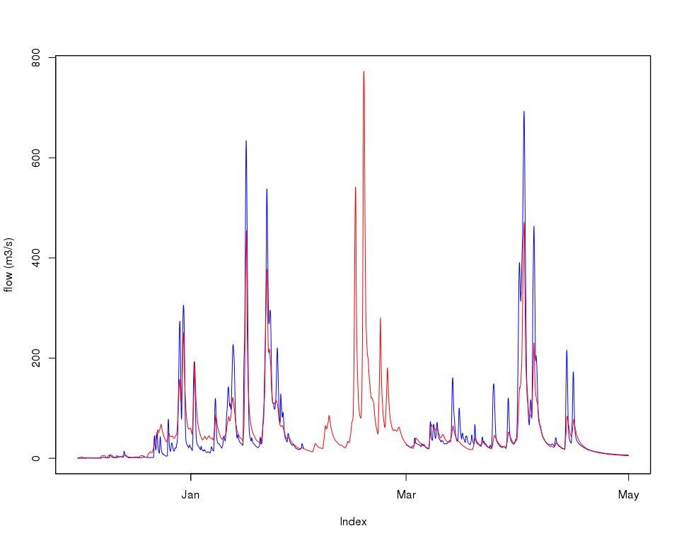
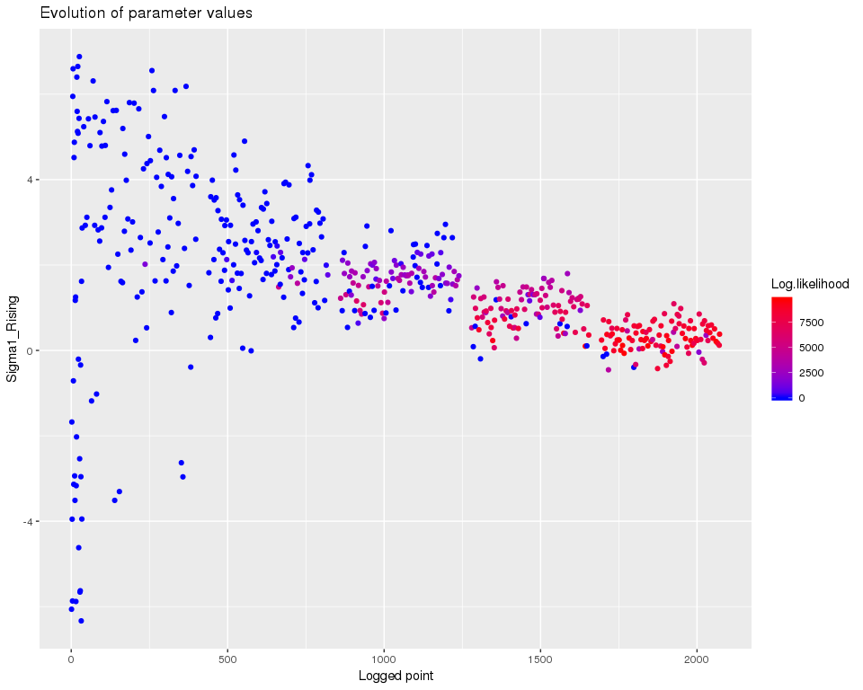
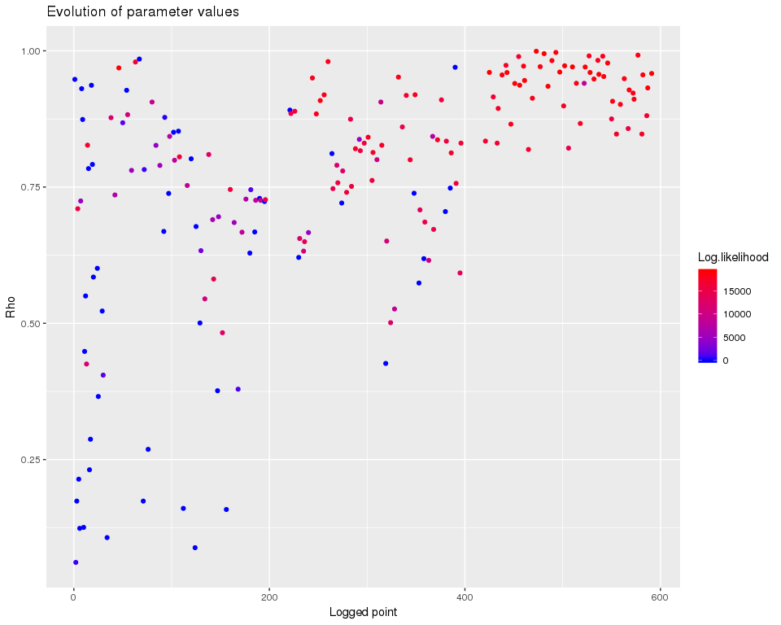
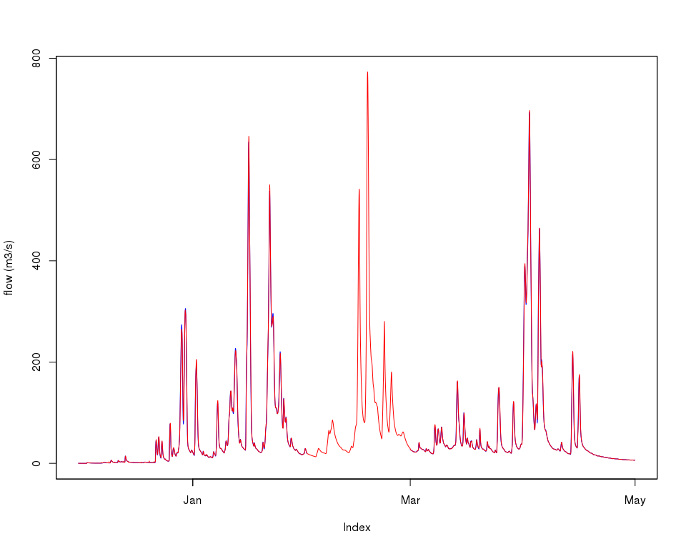

Error correction - ERRIS
================
Jean-Michel Perraud
2018-12-14

Error correction models - ERRIS
===============================

About this document
-------------------

This document was generated from an R markdown file on 2018-12-14 18:04:08.

[Li, Ming; Wang, QJ; Bennett, James; Robertson, David. Error reduction and representation in stages (ERRIS) in hydrological modelling for ensemble streamflow forecasting. Hydrology and Earth System Sciences. 2016; 20:3561-3579. https://doi.org/10.5194/hess-20-3561-2016](https://doi.org/10.5194/hess-20-3561-2016)

Calibrating ERRIS
-----------------

### Model structure

We use sample hourly data from the Adelaide catchment [this catchment in the Northern Territory, TBC](https://en.wikipedia.org/wiki/Adelaide_River). The catchment model set up is not the key point of this vignette so we do not comment on that section:

``` r
library(swift)
```

``` r
catchmentStructure <- sampleCatchmentModel(siteId = "Adelaide", configId = "catchment")

hydromodel <- "GR4J";
channel_routing <- 'MuskingumNonLinear';
hydroModelRainfallId <-'P'
hydroModelEvapId <-'E'

# set models
insimulation <- swapModel(catchmentStructure, modelId = hydromodel ,what = "runoff")
simulation <- swapModel(insimulation, modelId = channel_routing ,what = "channel_routing")

saId <- getSubareaIds(simulation)
stopifnot(length(saId) == 1)

precipTs <- sampleSeries(siteId = "Adelaide", varName = "rain")
evapTs <- sampleSeries(siteId = "Adelaide", varName = "evap")
flowRateTs <- sampleSeries(siteId = "Adelaide", varName = "flow")

playInput(simulation, precipTs, mkFullDataId('subarea', saId, hydroModelRainfallId))
playInput(simulation, evapTs, mkFullDataId('subarea', saId, hydroModelEvapId))
configureHourlyGr4j(simulation)
setSimulationTimeStep(simulation, 'hourly')

# Small time interval only, to reduce runtimes in this vignette
simstart <- uchronia::mkDate(2010,12,1)  
simend <- uchronia::mkDate(2011,6,30,23)  
simwarmup <- simstart
setSimulationSpan(simulation, simstart, simend)
```

``` r
templateHydroParameterizer <- function(simulation) {
  calibragem::defineParameterizerGr4jMuskingum(refArea=250, timeSpan=3600L, simulation=simulation, objfun='NSE', deltaT=1L)
}

nodeId <- 'node.2'
flowId <- mkFullDataId(nodeId, 'OutflowRate')

recordState(simulation, flowId)
```

We use pre-calibrated hydrologic parameters (reproducible with doc/error\_correction\_doc\_preparation.r in this package structure)

``` r
p <- templateHydroParameterizer(simulation)
setMinParameterValue(p, 'R0', 0.0)
setMaxParameterValue(p, 'R0', 1.0)
setMinParameterValue(p, 'S0', 0.0)
setMaxParameterValue(p, 'S0', 1.0)
SetParameterValue_R( p, 'log_x4', 1.017730e+00)
SetParameterValue_R( p, 'log_x1', 2.071974e+00  )
SetParameterValue_R( p, 'log_x3', 1.797909e+00  )
SetParameterValue_R( p, 'asinh_x2', -1.653842e+00)  
SetParameterValue_R( p, 'R0', 2.201930e-11  )
SetParameterValue_R( p, 'S0', 3.104968e-11  )
SetParameterValue_R( p, 'X', 6.595537e-03   ) # Gotcha: needs to be set before alpha is changed.
SetParameterValue_R( p, 'Alpha', 6.670534e-01   )
parameterizerAsDataFrame(p)
```

    ##       Name         Min        Max         Value
    ## 1   log_x4  0.00000000 2.38021124  1.017730e+00
    ## 2   log_x1  0.00000000 3.77815125  2.071974e+00
    ## 3   log_x3  0.00000000 3.00000000  1.797909e+00
    ## 4 asinh_x2 -3.98932681 3.98932681 -1.653842e+00
    ## 5       R0  0.00000000 1.00000000  2.201930e-11
    ## 6       S0  0.00000000 1.00000000  3.104968e-11
    ## 7        X  0.00100000 0.01662228  6.595537e-03
    ## 8    Alpha  0.01116157 1.68112917  6.670534e-01

``` r
sViz <- uchronia::mkDate(2010,12,1)
eViz <- uchronia::mkDate(2011,4,30,23)

oneWetSeason <- function(tts) {
    window(tts, start=sViz, end=eViz) 
}

obsVsCalc <- function(obs, calc, ylab="flow (m3/s)") {
  obs <- oneWetSeason(obs)
  calc <- oneWetSeason(calc)
    joki::plotTwoSeries(obs, calc, ylab=ylab, startTime = start(calc), endTime = end(calc))
}

applySysConfig(p, simulation)
execSimulation(simulation)
obsVsCalc(flowRateTs, getRecorded(simulation, flowId))
```


### Set up the error correction model

``` r
list(getNodeIds(simulation), 
getNodeNames(simulation))
```

    ## [[1]]
    ## [1] "2" "1"
    ## 
    ## [[2]]
    ## [1] "Outlet" "Node_1"

``` r
errorModelElementId <- 'node.2';
setErrorCorrectionModel(simulation, 'ERRIS', errorModelElementId, length=-1, seed=0)

flowRateTsGapped <- flowRateTs
flowRateTsGapped['2011-02'] <- NA

# plot(flowRateTsGapped)

playInput(simulation,flowRateTsGapped,varIds=mkFullDataId(errorModelElementId,"ec","Observation"))
```

Now, prepare a model with error correction, and set up for generation

``` r
ecs <- swift::CloneModel_R(simulation)

setStateValue(ecs,mkFullDataId(nodeId,"ec","Generating"),FALSE)
updatedFlowVarID <- mkFullDataId(nodeId,"ec","Updated")
inputFlowVarID <- mkFullDataId(nodeId,"ec","Input")
recordState(ecs,varIds=c(updatedFlowVarID, inputFlowVarID))
```

### ERRIS calibration in stages

``` r
#termination <- getMaxRuntimeTermination(0.005)
termination <- swift::CreateSceTerminationWila_Pkg_R('relative standard deviation', c('0.05','0.0167'))
```

We could set up a four-stages estimation in one go, but we will instead work in each stages for didactic purposes.

``` r
estimator <- createERRISParameterEstimator (simulation, flowRateTs, errorModelElementId,
                                            estimationStart = simstart, estimationEnd=simend, censThr=0.0,
                                            termination, restrictionOn=TRUE, weightedLeastSquare=FALSE)

stageOnePset = CalibrateERRISStageOne_R(estimator)
print(parameterizerAsDataFrame(stageOnePset))
```

    ##              Name    Min    Max        Value
    ## 1         Epsilon  -20.0    0.0   -7.7851564
    ## 2          Lambda  -30.0    5.0   -0.9391474
    ## 3               D    0.0    0.0    0.0000000
    ## 4              Mu    0.0    0.0    0.0000000
    ## 5             Rho    0.0    0.0    0.0000000
    ## 6  Sigma1_Falling    0.0    0.0    0.0000000
    ## 7   Sigma1_Rising    0.0    0.0    0.0000000
    ## 8  Sigma2_Falling    0.0    0.0    0.0000000
    ## 9   Sigma2_Rising    0.0    0.0    0.0000000
    ## 10 Weight_Falling    1.0    1.0    1.0000000
    ## 11  Weight_Rising    1.0    1.0    1.0000000
    ## 12        CensThr    0.0    0.0    0.0000000
    ## 13         MaxObs 1126.3 1126.3 1126.3000000

#### Stage 2

Stage two can be logged:

``` r
SetERRISVerboseCalibration_R(estimator, TRUE)

stageTwoPset = CalibrateERRISStageTwo_R(estimator, stageOnePset)
print(parameterizerAsDataFrame(stageTwoPset))
```

    ##              Name          Min          Max        Value
    ## 1               D    0.0000000    2.0000000    0.7818810
    ## 2              Mu -100.0000000  100.0000000   -1.2404133
    ## 3   Sigma1_Rising   -6.9077553    6.9077553    0.1088399
    ## 4         CensThr    0.0000000    0.0000000    0.0000000
    ## 5         Epsilon   -7.7851564   -7.7851564   -7.7851564
    ## 6          Lambda   -0.9391474   -0.9391474   -0.9391474
    ## 7          MaxObs 1126.3000000 1126.3000000 1126.3000000
    ## 8             Rho    0.0000000    0.0000000    0.0000000
    ## 9  Sigma1_Falling    0.0000000    0.0000000    0.0000000
    ## 10 Sigma2_Falling    0.0000000    0.0000000    0.0000000
    ## 11  Sigma2_Rising    0.0000000    0.0000000    0.0000000
    ## 12 Weight_Falling    1.0000000    1.0000000    1.0000000
    ## 13  Weight_Rising    1.0000000    1.0000000    1.0000000

``` r
mkEcIds <- function(p) {
  df <- parameterizerAsDataFrame(p)
  df$Name <- mkFullDataId(nodeId, 'ec', df$Name)
  createParameterizer('Generic',df)
}

applySysConfig(mkEcIds(stageTwoPset), ecs)
execSimulation(ecs)
obsVsCalc(flowRateTsGapped, getRecorded(ecs, updatedFlowVarID))
```



A helper function to process the calibration log:

``` r
prepOptimLog <- function(estimator, fitnessName = "Log.likelihood")
{
  optimLog = getLoggerContent(estimator)
  # head(optimLog)
  optimLog$PointNumber = 1:nrow(optimLog)   
  logMh <- mhplot::mkOptimLog(optimLog, fitness = fitnessName, messages = "Message", categories = "Category") 
  geomOps <- mhplot::subsetByMessage(logMh)
  d <- list(data=logMh, geomOps=geomOps)
}
```

``` r
d <- prepOptimLog(estimator, fitnessName = "Log.likelihood")
print(mhplot::plotParamEvolution(d$geomOps, 'Sigma1_Rising', c(0, max(d$data@data$Log.likelihood))))
```



#### Stage 3

``` r
stageThreePset = CalibrateERRISStageThree_R(estimator, stageTwoPset)
print(parameterizerAsDataFrame(stageThreePset))
```

    ##              Name          Min          Max        Value
    ## 1             Rho    0.0000000    1.0000000    0.9980095
    ## 2   Sigma1_Rising   -6.9077553    6.9077553   -1.5063062
    ## 3         CensThr    0.0000000    0.0000000    0.0000000
    ## 4               D    0.7818810    0.7818810    0.7818810
    ## 5         Epsilon   -7.7851564   -7.7851564   -7.7851564
    ## 6          Lambda   -0.9391474   -0.9391474   -0.9391474
    ## 7          MaxObs 1126.3000000 1126.3000000 1126.3000000
    ## 8              Mu   -1.2404133   -1.2404133   -1.2404133
    ## 9  Sigma1_Falling    0.0000000    0.0000000    0.0000000
    ## 10 Sigma2_Falling    0.0000000    0.0000000    0.0000000
    ## 11  Sigma2_Rising    0.0000000    0.0000000    0.0000000
    ## 12 Weight_Falling    1.0000000    1.0000000    1.0000000
    ## 13  Weight_Rising    1.0000000    1.0000000    1.0000000

``` r
d <- prepOptimLog(estimator, fitnessName = "Log.likelihood")
print(mhplot::plotParamEvolution(d$geomOps, 'Rho', c(0, max(d$data@data$Log.likelihood))))
```



#### Stage 3a, generating and fitting M and S if free

``` r
stageThreePsetMS = CalibrateERRISStageThreeMS_R(estimator, stageThreePset)
print(parameterizerAsDataFrame(stageThreePsetMS))
```

    ##              Name          Min          Max        Value
    ## 1             Rho    0.0000000    1.0000000    0.9980095
    ## 2   Sigma1_Rising   -6.9077553    6.9077553   -1.5063062
    ## 3         CensThr    0.0000000    0.0000000    0.0000000
    ## 4               D    0.7818810    0.7818810    0.7818810
    ## 5         Epsilon   -7.7851564   -7.7851564   -7.7851564
    ## 6          Lambda   -0.9391474   -0.9391474   -0.9391474
    ## 7          MaxObs 1126.3000000 1126.3000000 1126.3000000
    ## 8              Mu   -1.2404133   -1.2404133   -1.2404133
    ## 9  Sigma1_Falling    0.0000000    0.0000000    0.0000000
    ## 10 Sigma2_Falling    0.0000000    0.0000000    0.0000000
    ## 11  Sigma2_Rising    0.0000000    0.0000000    0.0000000
    ## 12 Weight_Falling    1.0000000    1.0000000    1.0000000
    ## 13  Weight_Rising    1.0000000    1.0000000    1.0000000
    ## 14         MNoise -100.0000000  100.0000000   -2.7835949
    ## 15         SNoise  -10.0000000   10.0000000    1.4207727

``` r
applySysConfig(mkEcIds(stageThreePsetMS), ecs)
execSimulation(ecs)
obsVsCalc(flowRateTsGapped, getRecorded(ecs, updatedFlowVarID))
```



#### Stage 4, rising limb

``` r
stageFourPsetRising = CalibrateERRISStageFour_R(estimator, stageThreePsetMS, useRising = TRUE)
print(parameterizerAsDataFrame(stageFourPsetRising))
```

    ##              Name          Min          Max         Value
    ## 1   Sigma1_Rising   -6.9077553    6.9077553   -1.67522575
    ## 2   Sigma2_Rising   -6.9077553    6.9077553   -0.05776246
    ## 3   Weight_Rising    0.5000000    1.0000000    0.84504633
    ## 4         CensThr    0.0000000    0.0000000    0.00000000
    ## 5               D    0.7818810    0.7818810    0.78188099
    ## 6         Epsilon   -7.7851564   -7.7851564   -7.78515641
    ## 7          Lambda   -0.9391474   -0.9391474   -0.93914737
    ## 8          MaxObs 1126.3000000 1126.3000000 1126.30000000
    ## 9              Mu   -1.2404133   -1.2404133   -1.24041326
    ## 10            Rho    0.9980095    0.9980095    0.99800949
    ## 11 Sigma1_Falling    0.0000000    0.0000000    0.00000000
    ## 12 Sigma2_Falling    0.0000000    0.0000000    0.00000000
    ## 13 Weight_Falling    1.0000000    1.0000000    1.00000000

``` r
d <- prepOptimLog(estimator, fitnessName = "Log.likelihood")
print(mhplot::plotParamEvolution(d$geomOps, 'Weight_Rising', c(0, max(d$data@data$Log.likelihood))))
```


``` r
applySysConfig(mkEcIds(stageFourPsetRising), ecs)
execSimulation(ecs)
obsVsCalc(flowRateTsGapped, getRecorded(ecs, updatedFlowVarID))
```


#### Stage 4, falling limbs

``` r
stageFourPsetFalling = CalibrateERRISStageFour_R(estimator, stageThreePsetMS, useRising = FALSE)
print(parameterizerAsDataFrame(stageFourPsetFalling))
```

    ##              Name          Min          Max        Value
    ## 1   Sigma1_Rising   -6.9077553    6.9077553   -3.7817510
    ## 2   Sigma2_Rising   -6.9077553    6.9077553   -1.3274962
    ## 3   Weight_Rising    0.5000000    1.0000000    0.7783264
    ## 4         CensThr    0.0000000    0.0000000    0.0000000
    ## 5               D    0.7818810    0.7818810    0.7818810
    ## 6         Epsilon   -7.7851564   -7.7851564   -7.7851564
    ## 7          Lambda   -0.9391474   -0.9391474   -0.9391474
    ## 8          MaxObs 1126.3000000 1126.3000000 1126.3000000
    ## 9              Mu   -1.2404133   -1.2404133   -1.2404133
    ## 10            Rho    0.9980095    0.9980095    0.9980095
    ## 11 Sigma1_Falling    0.0000000    0.0000000    0.0000000
    ## 12 Sigma2_Falling    0.0000000    0.0000000    0.0000000
    ## 13 Weight_Falling    1.0000000    1.0000000    1.0000000

``` r
Nd <- prepOptimLog(estimator, fitnessName = "Log.likelihood")
print(mhplot::plotParamEvolution(d$geomOps, 'Weight_Rising', c(0, max(d$data@data$Log.likelihood))))
```


#### Final consolidated parameter set

``` r
finalPset = ConcatenateERRISStagesParameters_R(estimator, hydroParams = createParameterizer(), stage1_result =  stageOnePset, stage2_result = stageTwoPset, 
                                   stage3_result = stageThreePsetMS, stage4a_result = stageFourPsetRising, stage4b_result = stageFourPsetFalling, toLongParameterName = FALSE)

print(parameterizerAsDataFrame(finalPset))
```

    ##              Name          Min          Max         Value
    ## 1         CensThr    0.0000000    0.0000000    0.00000000
    ## 2          MNoise -100.0000000  100.0000000   -2.78359487
    ## 3          SNoise  -10.0000000   10.0000000    1.42077266
    ## 4          Lambda   -0.9391474   -0.9391474   -0.93914737
    ## 5         Epsilon   -7.7851564   -7.7851564   -7.78515641
    ## 6              Mu   -1.2404133   -1.2404133   -1.24041326
    ## 7               D    0.7818810    0.7818810    0.78188099
    ## 8             Rho    0.9980095    0.9980095    0.99800949
    ## 9          MaxObs 1126.3000000 1126.3000000 1126.30000000
    ## 10  Sigma1_Rising   -6.9077553    6.9077553   -1.67522575
    ## 11  Sigma2_Rising   -6.9077553    6.9077553   -0.05776246
    ## 12  Weight_Rising    0.5000000    1.0000000    0.84504633
    ## 13 Sigma1_Falling   -6.9077553    6.9077553   -3.78175102
    ## 14 Sigma2_Falling   -6.9077553    6.9077553   -1.32749618
    ## 15 Weight_Falling    0.5000000    1.0000000    0.77832639

### Legacy call

Check that the previous "one stop shop" call gives the same results.

``` r
dummyDate <- simstart

psetFullEstimate <- estimateERRISParameters(simulation, flowRateTs, errorModelElementId,
  warmupStart=dummyDate, warmupEnd=dummyDate, warmup=FALSE, estimationStart = simstart, estimationEnd=simend, censThr=0.0,
  exclusionStart=dummyDate, exclusionEnd=dummyDate, exclusion=FALSE, terminationCondition = termination,
  hydroParams = NULL, errisParams = NULL, restrictionOn = TRUE,
  weightedLeastSquare = FALSE)

print(parameterizerAsDataFrame(psetFullEstimate))
```

    ##                        Name          Min          Max         Value
    ## 1         node.2.ec.CensThr    0.0000000    0.0000000    0.00000000
    ## 2          node.2.ec.MNoise -100.0000000  100.0000000   -2.78359487
    ## 3          node.2.ec.SNoise  -10.0000000   10.0000000    1.42077266
    ## 4          node.2.ec.Lambda   -0.9391474   -0.9391474   -0.93914737
    ## 5         node.2.ec.Epsilon   -7.7851564   -7.7851564   -7.78515641
    ## 6              node.2.ec.Mu   -1.2404133   -1.2404133   -1.24041326
    ## 7               node.2.ec.D    0.7818810    0.7818810    0.78188099
    ## 8             node.2.ec.Rho    0.9980095    0.9980095    0.99800949
    ## 9          node.2.ec.MaxObs 1126.3000000 1126.3000000 1126.30000000
    ## 10  node.2.ec.Sigma1_Rising   -6.9077553    6.9077553   -1.67522575
    ## 11  node.2.ec.Sigma2_Rising   -6.9077553    6.9077553   -0.05776246
    ## 12  node.2.ec.Weight_Rising    0.5000000    1.0000000    0.84504633
    ## 13 node.2.ec.Sigma1_Falling   -6.9077553    6.9077553   -3.78175102
    ## 14 node.2.ec.Sigma2_Falling   -6.9077553    6.9077553   -1.32749618
    ## 15 node.2.ec.Weight_Falling    0.5000000    1.0000000    0.77832639
