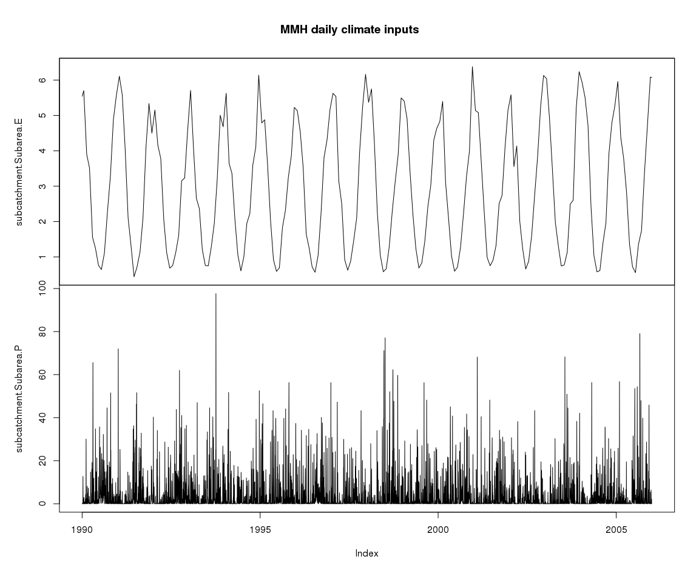
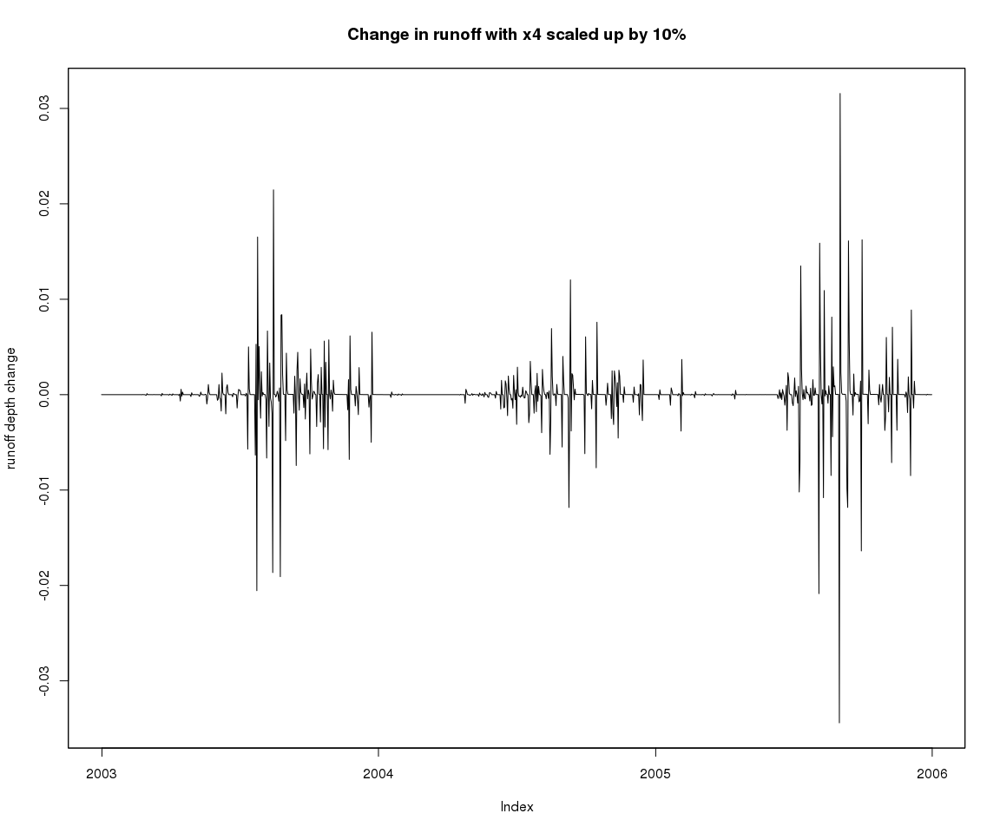
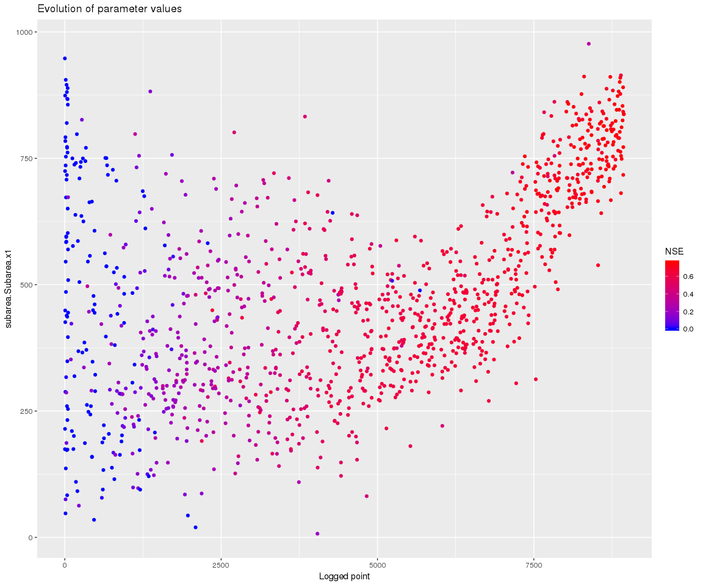
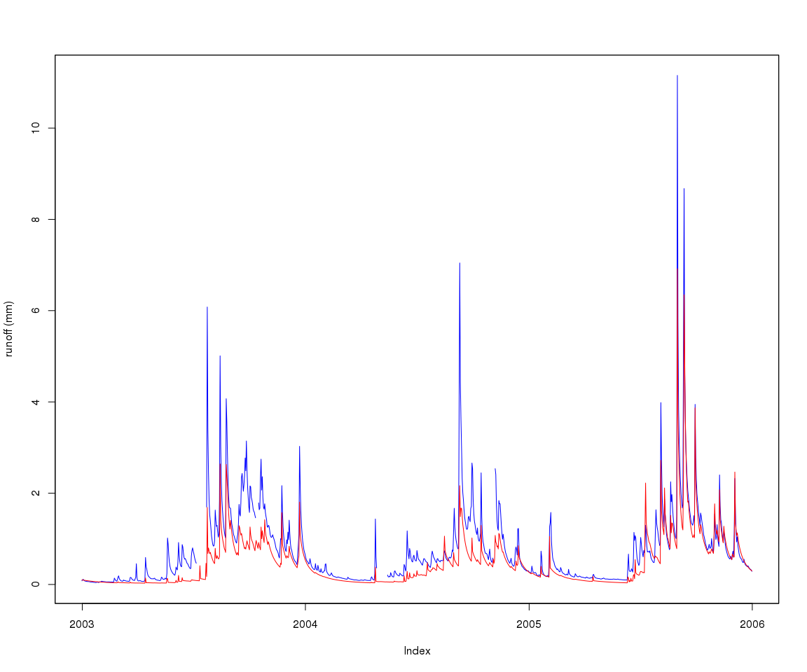

Getting started with the swift R package
================
Jean-Michel Perraud
2018-04-13

Getting started with the SWIFT R package
========================================

About this document
===================

This document was generated from an R markdown file on 2018-04-13 17:36:51. It is the introduction 'vignette' to an R package for interacting with SWIFT.

It shows one of the most basic usage, running a single model simulation. While basic, it is realistic and uses data from a study catchment.

Getting started
===============

Load the R package the usual way...

``` r
library(swift)
```

It includes a fair level of documentation, that should be accessible using the '?' command, shortcut for help(swift).

``` r
?swift
?getRecorded
```

The package contains some sample data for a few Australian catchments

``` r
data('swift_sample_data')
names(swiftSampleData)
```

    ## [1] "MMH"       "Ovens"     "Abbeyard"  "07378500"  "South_Esk"

**swift** now has some functions to create a single subarea simulation for testing purposes. While is it perfectly possible to manually build your own model simulation from scratch, for the sake of getting started quickly let's use pre-defined functions to get a model simulation ready to run. The parameters of the function should be fairly self-explanatory to you:

``` r
ms <- createSubareaSimulation(dataId='MMH', simulStart='1990-01-01', simulEnd='2005-12-31', 
    modelId='GR4J', tstep='daily', varNameRain='P', varNamePet='E')
str(ms)
```

    ## Formal class 'ExternalObjRef' [package "cinterop"] with 2 slots
    ##   ..@ obj :<externalptr> 
    ##   ..@ type: chr "MODEL_SIMULATION_PTR"

The R object 'ms' may appear unusual to many R users. This is basically a handle to the SWIFT simulation written in C++. It is passed as an argument to R functions, and you do not need to know more details than this.

The simulation we just created is ready to execute, which means it already has some input data defined (site 'MMH'). We can inspect it for instance with:

``` r
head(getPlayed(ms))
```

    ## Warning: timezone of object (UTC) is different than current timezone ().

    ##            subcatchment.Subarea.E subcatchment.Subarea.P
    ## 1990-01-01               5.542243               0.000000
    ## 1990-01-02               5.552225               0.000000
    ## 1990-01-03               5.562208               0.000000
    ## 1990-01-04               5.572191               0.000000
    ## 1990-01-05               5.582174               0.000000
    ## 1990-01-06               5.592156               0.526757

``` r
zoo::plot.zoo(getPlayed(ms), main='MMH daily climate inputs')
```



The simulation has no output to record to time series defined yet. SWIFT is designed to record model variables on demand in a highly flexible manner. First, we can query the system to find out known models, and the model variable names that we can record.

``` r
getRecordedVarnames(ms)
```

    ## character(0)

``` r
runoffModelIds()
```

    ##  [1] "NetRainfall"   "GR4J"          "GR5H"          "GR6J"         
    ##  [5] "GR5J"          "PDM"           "AWBM"          "SACSMA"       
    ##  [9] "const_outflow" "external"

``` r
gr4jModelVars <- runoffModelVarIds('GR4J')
print(gr4jModelVars)
```

    ##  [1] "P"          "E"          "runoff"     "S"          "R"         
    ##  [6] "Ps"         "Es"         "Pr"         "ech1"       "ech2"      
    ## [11] "Perc"       "x1"         "x2"         "x3"         "x4"        
    ## [16] "UHExponent" "PercFactor"

These are the variable names for a single GR4J model instance; since SWIFT is for semi-distributed models, we need to use a hierarchical naming scheme to uniquely identify model variables (even when in this case we do have only one subarea). Using unique keys allow to inspect the model states in great details if needed.

``` r
getSubareaIds(ms)
```

    ## [1] "Subarea"

``` r
getStateValue(ms, 'subarea.Subarea.x4')
```

    ## subarea.Subarea.x4 
    ##                0.5

Let's record to time series all the storage and flux states of GR4J (no need to record model parameters which will be flat lines here)

``` r
recordState(ms, paste0('subarea.Subarea.', toRecord))
getRecordedVarnames(ms)
```

    ## [1] "subarea.Subarea.Es"     "subarea.Subarea.Perc"  
    ## [3] "subarea.Subarea.Pr"     "subarea.Subarea.Ps"    
    ## [5] "subarea.Subarea.R"      "subarea.Subarea.S"     
    ## [7] "subarea.Subarea.ech1"   "subarea.Subarea.ech2"  
    ## [9] "subarea.Subarea.runoff"

And let's run

``` r
execSimulation(ms)
```

We do a bit of text preprocessing to shorten the default names of the time series ('xts' objects in R), but otherwise default time series plots are straightforward.

``` r
varSeries = getRecorded(ms)
str(varSeries)
```

    ## An 'xts' object on 1990-01-01/2005-12-31 containing:
    ##   Data: num [1:5844, 1:9] 0 0 0 0 0 ...
    ##  - attr(*, "dimnames")=List of 2
    ##   ..$ : NULL
    ##   ..$ : chr [1:9] "subarea.Subarea.Es" "subarea.Subarea.Perc" "subarea.Subarea.Pr" "subarea.Subarea.Ps" ...
    ##   Indexed by objects of class: [POSIXct,POSIXt] TZ: UTC
    ##   xts Attributes:  
    ##  NULL

``` r
names(varSeries) <- gsub(names(varSeries), pattern="subarea\\.Subarea\\.", replacement='')
zoo::plot.zoo(varSeries, main = 'Default GR4J output on MMH data')
```


Let's look at a shorter period of the output; we can demonstrate the use of the **lubridate** package for convenient date-time arithmetic, and the window function. We define a couple of functions to slice and plot the last three years of the time series.

``` r
library(lubridate)

lastThreeYears <- function(tts) {
    window(tts, start=end(tts)-lubridate::years(3), end=end(tts)) 
}
obsVsCalc <- function(obs, calc, ylab="runoff (mm)") {
    obs <- lastThreeYears(obs)
    joki::plotTwoSeries(obs, calc, ylab=ylab, startTime = start(obs), endTime = end(obs))
}
```

``` r
zoo::plot.zoo(lastThreeYears(varSeries), main = 'Default GR4J output on MMH data')
```


Exploring the model interactively
=================================

As mentioned earlier, it is possibly to define the model simulation definition directly and interactively. The following shows how a to assign another input time series, with a somewhat contrived example of a scaled up precipitation input series.

``` r
precipId <- 'subcatchment.Subarea.P'
runoffId <- 'subarea.Subarea.runoff'
precip <- getPlayed(ms, precipId)
baselineRunoff <- getRecorded(ms, runoffId)
precipScaled <- precip * 1.1
playInput(ms, precipScaled, precipId)
execSimulation(ms)
runoffDiff <- getRecorded(ms, runoffId) - baselineRunoff
zoo::plot.zoo(lastThreeYears(runoffDiff), main = 'Additional runoff with scaled up precipitation', ylab='runoff depth change (mm)')
```


Let's get back to the initial input settings, and demonstrate one way to change parameters interactively. Note that this is not necessarily the recommended way to handle model parameterisation, as will be made clear later in this document when setting up calibration. You can already see how the code required for just one parameter is more length.

``` r
playInput(ms, precip, precipId)
x4Id <- 'subarea.Subarea.x4'
(x4 <- getStateValue(ms, x4Id))
```

    ## subarea.Subarea.x4 
    ##                0.5

``` r
setStateValue(ms, x4Id, x4*1.1)
execSimulation(ms)
runoffDiff <- getRecorded(ms, runoffId) - baselineRunoff
zoo::plot.zoo(lastThreeYears(runoffDiff), main = 'Change in runoff with x4 scaled up by 10%', ylab='runoff depth change')
```



``` r
setStateValue(ms, x4Id, x4)
```

Calibration
===========

Let's st up a calibration against the observed runoff depth for 'MMH', included as sample data in the package, and view it along the current default model runoff output.

``` r
obsRunoff <- sampleSeries('MMH', 'flow') #actually, runoff depth
obsRunoff[which(obsRunoff < -1)] <- NA
obsVsCalc(obsRunoff, baselineRunoff)
```


First let's define the objective of the calibration, the Nash-Sutcliffe efficiency (NSE) for the runoff depth. We'll use two years of data as warmup.

``` r
s <- start(obsRunoff)
w <- s + lubridate::years(2)
e <- end(obsRunoff)
setSimulationSpan(ms, s, e)
objective <- createObjective(ms, runoffId, obsRunoff, 'NSE', w, e)
```

While we can tweak model parameters directly from R one by one as shown in the previous paragraph, there are tools available in the core SWIFT library for catchment parameterization. These are more scalable to catchments with a large number of sub-areas. In this section we'll use a generic parameterizer. Other forms available are parameterizers applying scaled "meta-parameters" to subareas, based for instance on the surface of each subarea.

Starting from an arbitrary template data frame for GR4J parameters:

``` r
(pSpecGr4j <- joki::getFreeParams('GR4J'))
```

    ##   Name      Value Min  Max
    ## 1   x1 650.488000   1 3000
    ## 2   x2  -0.280648 -27   27
    ## 3   x3   7.891230   1  660
    ## 4   x4  18.917200   1  240

``` r
pSpecGr4j$Value <- c(542.1981111,  -0.4127542,   7.7403390 ,  1.2388548)
pSpecGr4j$Min <- c(1,-30, 1,1)
pSpecGr4j$Max <- c(1000, 30, 1000, 240)
```

The template is using the short names of the GR4J parameters; our SWIFT parameterizer here is generic and needs the full hierarchical name of the model variable identifiers

``` r
pSpecGr4j$Name <- paste0('subarea.Subarea.', pSpecGr4j$Name)
p <- createParameterizer(type='Generic', pSpecGr4j)
parameterizerAsDataFrame(p)
```

    ##                 Name Min  Max       Value
    ## 1 subarea.Subarea.x1   1 1000 542.1981111
    ## 2 subarea.Subarea.x2 -30   30  -0.4127542
    ## 3 subarea.Subarea.x3   1 1000   7.7403390
    ## 4 subarea.Subarea.x4   1  240   1.2388548

Let's see the default goodness of fit for these parameters. Unsurprisingly, fairly poor. The purpose of the following lines is to show how to get manually objective score values.

``` r
score <- getScore(objective, p)
print(score)
```

    ## $scores
    ##       NSE 
    ## -2.338177 
    ## 
    ## $sysconfig
    ##                 Name Min  Max       Value
    ## 1 subarea.Subarea.x1   1 1000 542.1981111
    ## 2 subarea.Subarea.x2 -30   30  -0.4127542
    ## 3 subarea.Subarea.x3   1 1000   7.7403390
    ## 4 subarea.Subarea.x4   1  240   1.2388548

We have our objectives defined, and the parameter space 'p' in which to search. Let's create an optimizer and we are ready to go. While the optimizer can be created in one line, we show how to choose one custom termination criterion and how to configure the optimizer to capture a detailed log of the process.

``` r
# term <- getMarginalTermination(tolerance = 1e-06, cutoffNoImprovement = 100, maxHours = 0.05) 
term <- getMaxRuntimeTermination(maxHours = 0.0015) 

sceParams <- getDefaultSceParameters()
urs <- createParameterSampler(0, p, 'urs')
optimizer <- createSceOptimSwift(objective, term, SCEpars=sceParams, urs)

calibLogger <- setCalibrationLogger(optimizer, '')
```

``` r
startTime <- lubridate::now()
```

    ## Warning in with_tz(Sys.time(), tzone): Unrecognized time zone ''

``` r
calibResults <- executeOptimization(optimizer)
endTime <- lubridate::now()
```

    ## Warning in with_tz(Sys.time(), tzone): Unrecognized time zone ''

``` r
calibWallTime <- endTime-startTime
print(paste( 'Optimization completed in ', calibWallTime, attr(calibWallTime, 'units')))
```

    ## [1] "Optimization completed in  5.39394927024841 secs"

**swift** uses optimization tools that will parallelize model simulation runs if possible (i.e. if supported by the model).

There are high level functions in the packages **swift** and **mhplot** to import the optimisation log information into R data structures

``` r
d <- getLoggerContent(optimizer)
d$PointNumber = 1:nrow(d)
logMh <- mhplot::mkOptimLog(d, fitness = "NSE", messages = "Message", categories = "Category") 
geomOps <- mhplot::subsetByMessage(logMh)
str(geomOps@data)
```

    ## 'data.frame':    2092 obs. of  9 variables:
    ##  $ Category          : Factor w/ 7 levels "Complex No 0",..: 7 7 7 7 7 7 7 7 7 7 ...
    ##  $ CurrentShuffle    : Factor w/ 33 levels "","0","1","10",..: 1 1 1 1 1 1 1 1 1 1 ...
    ##  $ Message           : Factor w/ 5 levels "Adding a random point in hypercube",..: 3 3 3 3 3 3 3 3 3 3 ...
    ##  $ NSE               : num  -1339.286 -0.891 -0.327 -2.367 -913.047 ...
    ##  $ subarea.Subarea.x1: num  948 175 215 725 874 ...
    ##  $ subarea.Subarea.x2: num  23.01 -7.28 -7.07 6.66 28.64 ...
    ##  $ subarea.Subarea.x3: num  62.2 710.5 124.6 930.6 126.4 ...
    ##  $ subarea.Subarea.x4: num  161.9 96.4 19 207.7 83.7 ...
    ##  $ PointNumber       : int  1 2 3 4 5 6 7 8 9 10 ...

We can see that at least one of the parameters settled at one of its boundaries:

``` r
pVarIds <- parameterizerAsDataFrame(p)$Name
pVarIds
```

    ## [1] "subarea.Subarea.x1" "subarea.Subarea.x2" "subarea.Subarea.x3"
    ## [4] "subarea.Subarea.x4"

``` r
print(mhplot::plotParamEvolution(geomOps, pVarIds[1], objLims=c(0,1)))
```



Note that the parameter x4 also seems to have settled at its lower bound. x4 influences the unit hydrograph, and the meaning of this parameter depends on the time step of the input series. It may be justified in this case to go below 1 for its lower bound.

``` r
print(mhplot::plotParamEvolution(geomOps, pVarIds[4], objLims=c(0,1)))
```


So let's restart, with a larger upper bound for the x1 parameter:

``` r
pSpecGr4j$Max <- c(2500, 30, 1000, 240)
pSpecGr4j$Min <- c(1,-30, 1,0.2)
p <- createParameterizer(type='Generic', pSpecGr4j)
urs <- createParameterSampler(0, p, 'urs')
optimizer <- createSceOptimSwift(objective, term, SCEpars=sceParams, urs)
calibLogger <- setCalibrationLogger(optimizer, '')
calibResults <- executeOptimization(optimizer)
d <- getLoggerContent(optimizer)
d$PointNumber = 1:nrow(d)
logMh <- mhplot::mkOptimLog(d, fitness = "NSE", messages = "Message", categories = "Category") 
geomOps <- mhplot::subsetByMessage(logMh)
```

Let's check that the parameter does not settle at the boundary anymore:

``` r
print(mhplot::plotParamEvolution(geomOps, pVarIds[1], objLims=c(0,1)))
```


Let's apply the parameter set with the best NSE, and see the resulting runoff time series. Note that we see only the last 3 years of time series, over drier years, while the NSE score is calculated in several more years.

``` r
sortedResults <- sortByScore(calibResults, 'NSE')
head(scoresAsDataFrame(sortedResults))
```

    ##         NSE subarea.Subarea.x1 subarea.Subarea.x2 subarea.Subarea.x3
    ## 1 0.7832231           1141.613          -5.437475           97.48305
    ## 2 0.7832231           1141.763          -5.436954           97.47216
    ## 3 0.7832231           1141.710          -5.436987           97.47743
    ## 4 0.7832231           1141.694          -5.437763           97.47471
    ## 5 0.7832231           1141.688          -5.437670           97.46638
    ## 6 0.7832231           1141.675          -5.437706           97.46622
    ##   subarea.Subarea.x4
    ## 1          0.4322110
    ## 2          0.4160575
    ## 3          0.4273673
    ## 4          0.4287794
    ## 5          0.4293835
    ## 6          0.4322954

``` r
bestPset <- getScoreAtIndex(sortedResults, 1)
applySysConfig(bestPset, ms)
execSimulation(ms)
obsVsCalc(obsRunoff, getRecorded(ms, runoffId))
```


