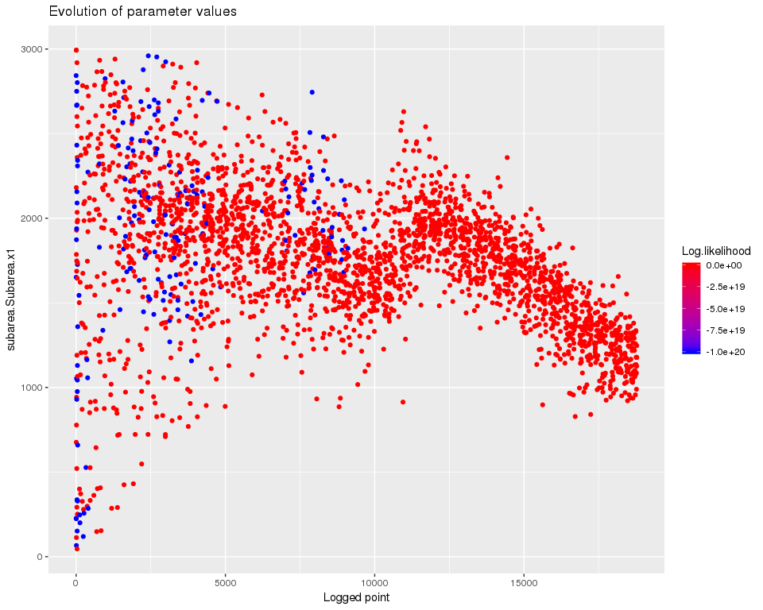
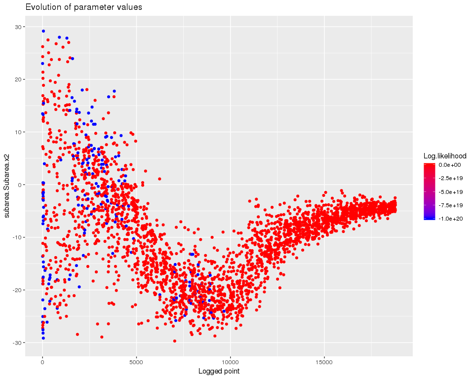
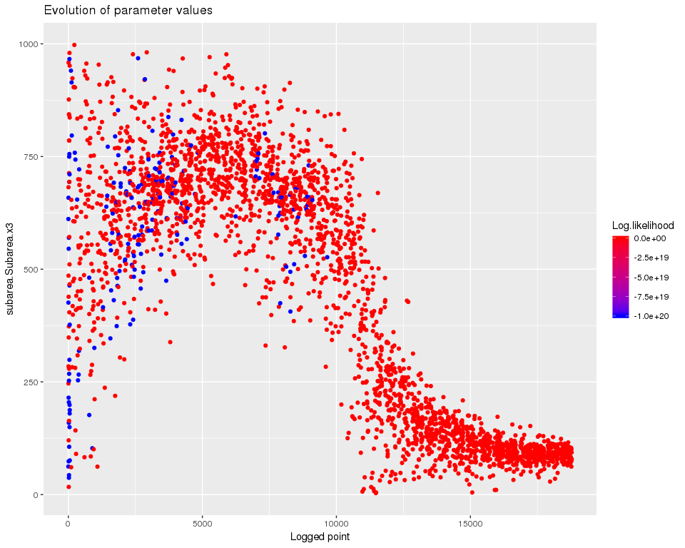
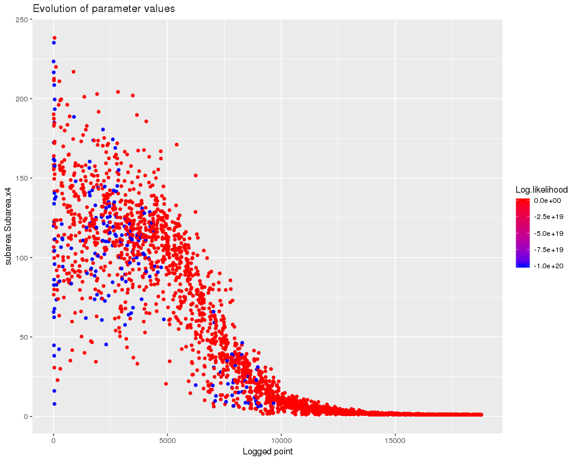
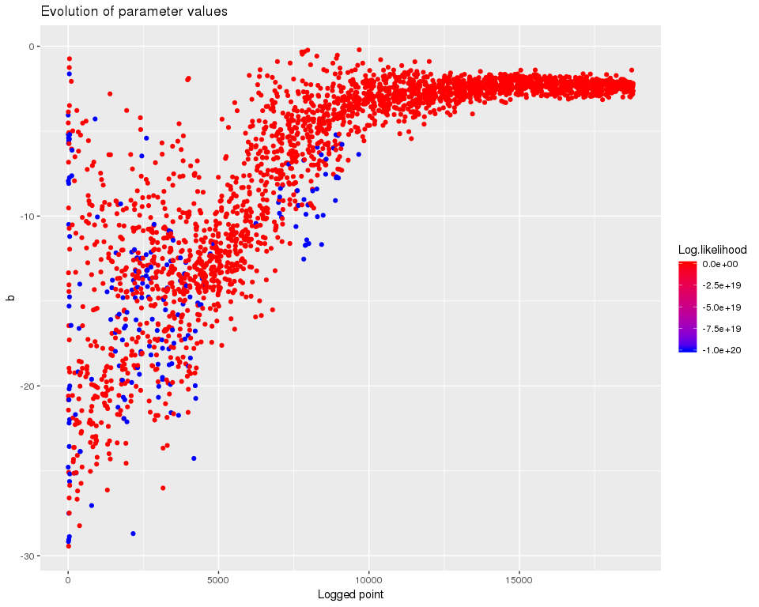
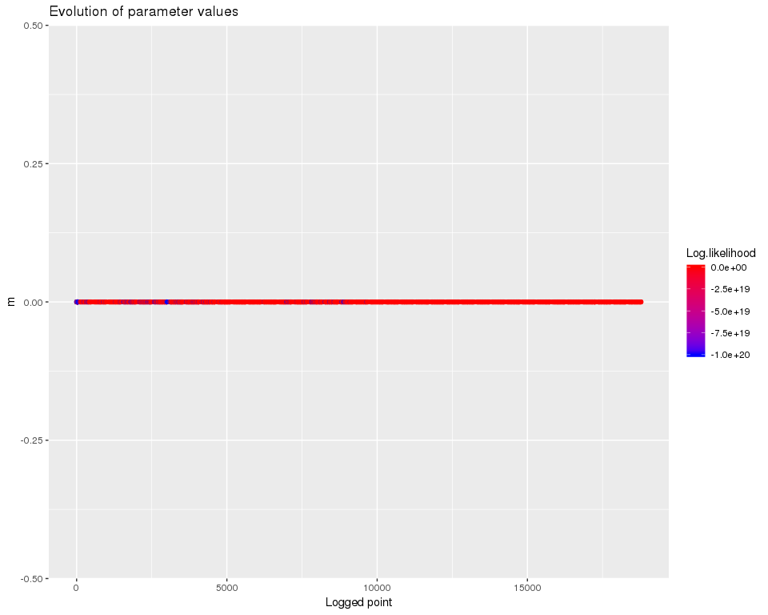
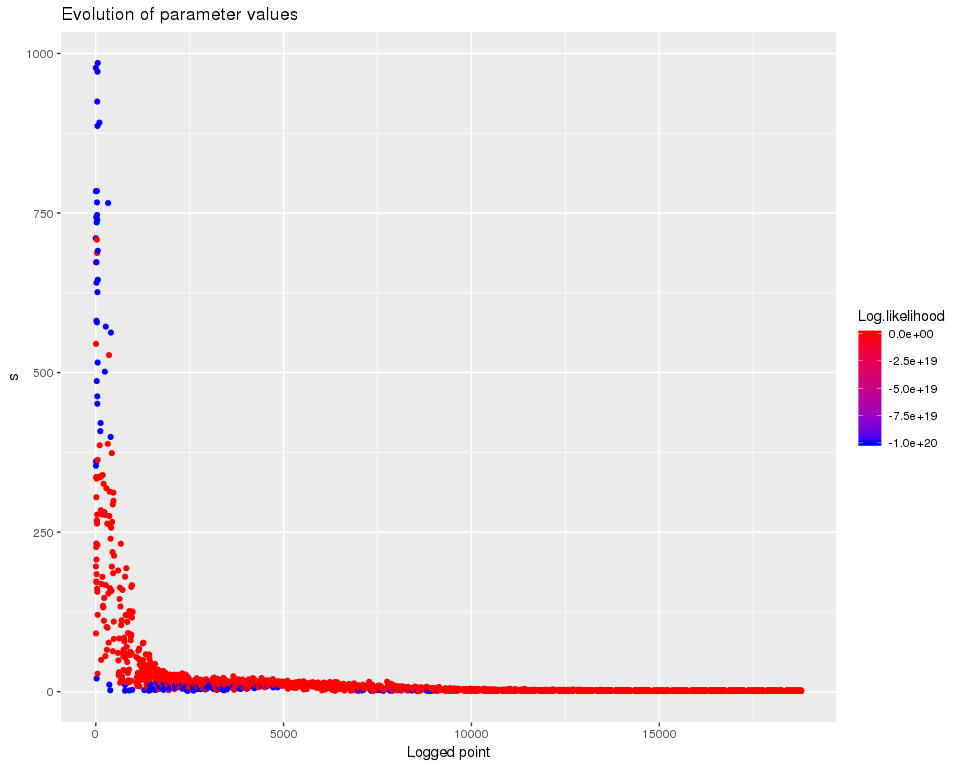
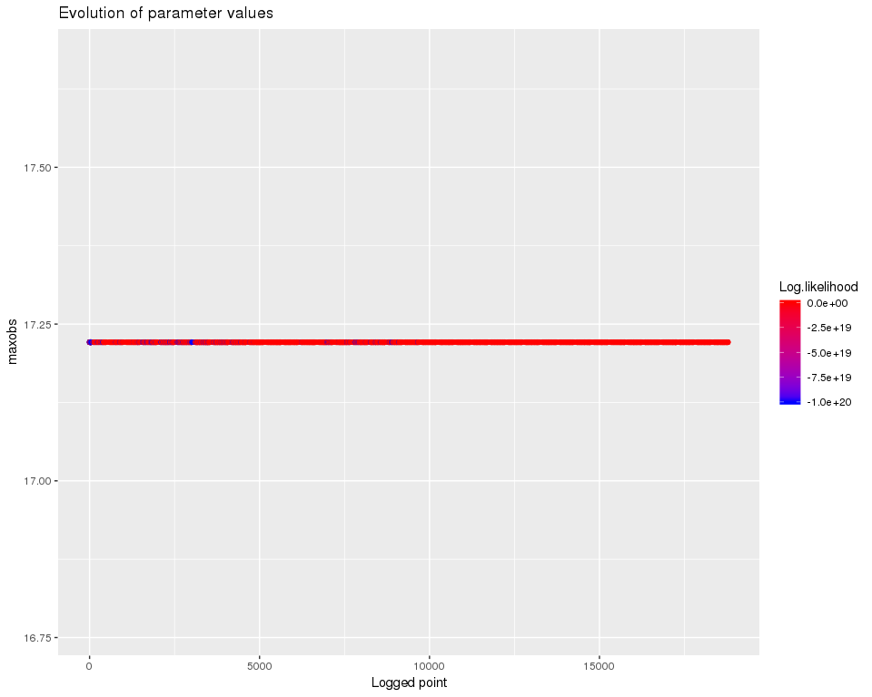
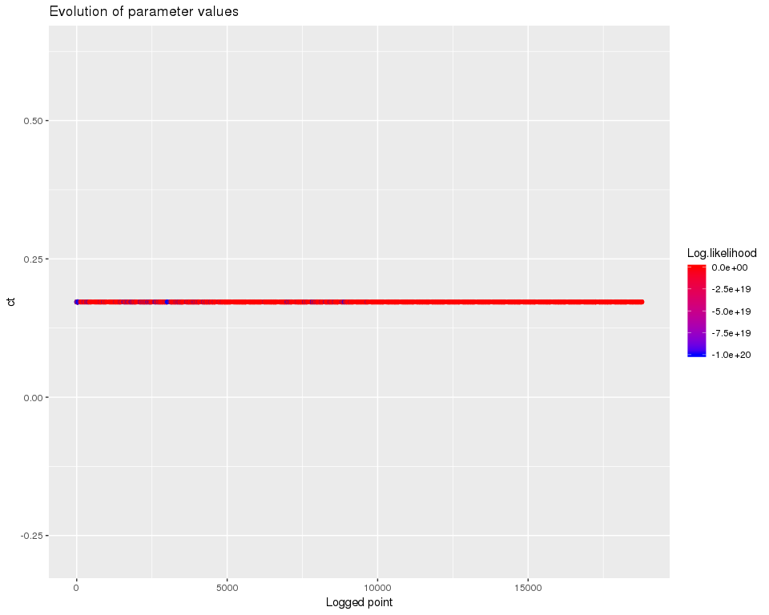
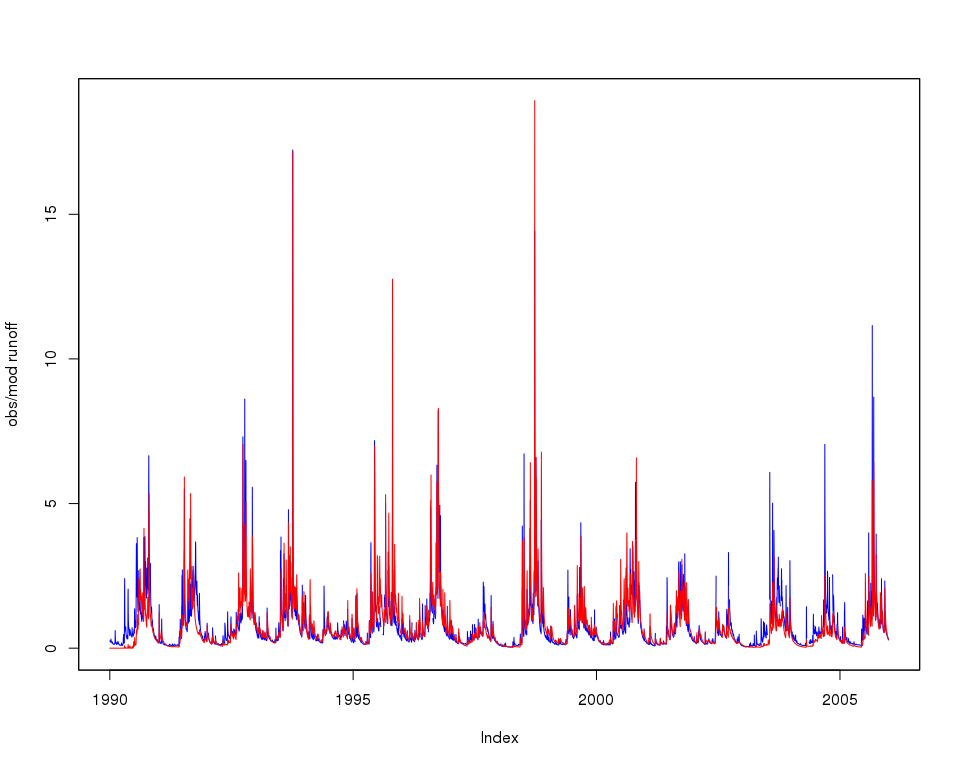

Sample code for log-likelihood calibration
================
Jean-Michel Perraud
2018-12-14

Sample code for log-likelihood calibration
==========================================

About this document
===================

This document was generated from an R markdown file on 2018-12-14 18:07:35. It illustrates how to set up a calibration with a log-likelihood objective.

Setting up a calibration on daily data
======================================

We will use some sample data from (MMH - Minamata?) included in the package

``` r
library(lubridate)
library(swift)
```

``` r
data(swift_sample_data)
sSpan <- '1990-01-01/2005-12-31'
rain <- sampleSeries('MMH', 'rain')[sSpan]
evap <- sampleSeries('MMH', 'evap')[sSpan]
flow <- sampleSeries('MMH', 'flow')[sSpan]
```

We need to adjust the observed flow, as the SWIFTv1 legacy missing value code is not consistent with default handling in SAK.

``` r
flow[flow<0] <- NA
```

Let's create a single catchment setup, using daily data. We need so specify the simulation time step to be consistent with the daily input data.

``` r
ms <- createSubarea('GR4J', 1.0)
s <- start(rain)
e <- end(rain)
setSimulationSpan(ms, s, e)
setSimulationTimeStep(ms, 'daily')
```

Assign input time series

``` r
subAreaName <- getSubareaNames(ms)[1]
playSubareaInput(ms, input=rain, subAreaName, "P")
playSubareaInput(ms, input=evap, subAreaName, "E")
```

Model variables identifiers are hierarchical, with separators '.' and '|' supported. The "dot" notation should now be preferred, as some R functions producing data frames may change the variable names and replace some characters with '.'.

``` r
subareaId <- paste0("subarea.", subAreaName)
rootId <- paste0(subareaId, ".")
print(getVariableIds(ms, subareaId))
```

    ##  [1] "areaKm2"       "P"             "E"             "runoff"       
    ##  [5] "S"             "R"             "Ps"            "Es"           
    ##  [9] "Pr"            "ech1"          "ech2"          "Perc"         
    ## [13] "x1"            "x2"            "x3"            "x4"           
    ## [17] "UHExponent"    "PercFactor"    "OutflowVolume" "OutflowRate"

``` r
gr4StateNames <- paste0(rootId, c('runoff', 'S', 'R', 'Perc'))
for (name in gr4StateNames) { recordState(ms, name) }
```

Let's check that one simulation runs fine, before we build a calibration definition.

``` r
execSimulation(ms)
sState <- getRecorded(ms, gr4StateNames[2])
names(sState) <- shortVarId(names(sState))
zoo::plot.zoo(sState)
```


Let's build the objective calculator that will guide the calibration process:

``` r
w <- uchronia::mkDate(1992, 01, 01)
runoffDepthVarname <- gr4StateNames[1]
modRunoff <- getRecorded(ms, runoffDepthVarname)
zoo::index(flow) <- zoo::index(modRunoff)
objective <- createObjective(ms, runoffDepthVarname, flow, 'log-likelihood', w, e)
```

Define the feasible parameter space, using a generic parameter set for the model parameters. This is 'wrapped' by a log-likelihood parameter set with the extra parameters used in the log likelihood calculation, but which exposes all the parameters as 8 independent degrees of freedom to the optimizer.

``` r
(pSpecGr4j <- joki::getFreeParams('GR4J'))
```

    ##   Name      Value Min  Max
    ## 1   x1 650.488000   1 3000
    ## 2   x2  -0.280648 -27   27
    ## 3   x3   7.891230   1  660
    ## 4   x4  18.917200   1  240

``` r
pSpecGr4j$Value <- c(542.1981111, -0.4127542, 7.7403390, 1.2388548)
pSpecGr4j$Min <- c(1,-30, 1,1)
pSpecGr4j$Max <- c(3000, 30, 1000, 240)
pSpecGr4j$Name <- paste0(rootId, pSpecGr4j$Name)


maxobs <- max(flow, na.rm=TRUE)
p <- createParameterizer(type='Generic', specs=pSpecGr4j)
setLogLikParamKeys(a='a', b='b', m='m', s='s', ct="ct")
censorThreshold <- maxobs / 100 # TBC

loglik <- createParameterizer(type='no apply')
addToHyperCube(loglik, 
          data.frame( Name=c('b','m','s','a','maxobs','ct'),
          Min   = c(-30, 0, 1,    -30, maxobs, censorThreshold),
          Max   = c(0,   0, 1000, 1, maxobs, censorThreshold),
          Value = c(-7,  0, 100,  -10, maxobs, censorThreshold),
          stringsAsFactors=FALSE) )
p <- concatenateParameterizers(p, loglik)
parameterizerAsDataFrame(p)
```

    ##                  Name         Min          Max       Value
    ## 1  subarea.Subarea.x1   1.0000000 3000.0000000 542.1981111
    ## 2  subarea.Subarea.x2 -30.0000000   30.0000000  -0.4127542
    ## 3  subarea.Subarea.x3   1.0000000 1000.0000000   7.7403390
    ## 4  subarea.Subarea.x4   1.0000000  240.0000000   1.2388548
    ## 5                   b -30.0000000    0.0000000  -7.0000000
    ## 6                   m   0.0000000    0.0000000   0.0000000
    ## 7                   s   1.0000000 1000.0000000 100.0000000
    ## 8                   a -30.0000000    1.0000000 -10.0000000
    ## 9              maxobs  17.2211304   17.2211304  17.2211304
    ## 10                 ct   0.1722113    0.1722113   0.1722113

Check that the objective calculator works, at least with the default values in the feasible parameter space:

``` r
score <- getScore(objective, p)
print(score)
```

    ## $scores
    ## Log-likelihood 
    ##      -464090.7 
    ## 
    ## $sysconfig
    ##                  Name         Min          Max       Value
    ## 1  subarea.Subarea.x1   1.0000000 3000.0000000 542.1981111
    ## 2  subarea.Subarea.x2 -30.0000000   30.0000000  -0.4127542
    ## 3  subarea.Subarea.x3   1.0000000 1000.0000000   7.7403390
    ## 4  subarea.Subarea.x4   1.0000000  240.0000000   1.2388548
    ## 5                   b -30.0000000    0.0000000  -7.0000000
    ## 6                   m   0.0000000    0.0000000   0.0000000
    ## 7                   s   1.0000000 1000.0000000 100.0000000
    ## 8                   a -30.0000000    1.0000000 -10.0000000
    ## 9              maxobs  17.2211304   17.2211304  17.2211304
    ## 10                 ct   0.1722113    0.1722113   0.1722113

``` r
modRunoff <- getRecorded(ms, runoffDepthVarname)
joki::plotTwoSeries(flow, modRunoff, ylab="obs/mod runoff", startTime = start(flow), endTime = end(flow))
```


Build the optimiser definition, instrument with a logger.

``` r
# term <- getMaxRuntimeTermination(maxHours = 0.3/60)  # ~20 second appears enough with SWIFT binaries in Release mode
# term <- getMarginalTermination(tolerance = 1e-06, cutoffNoImprovement = 10, maxHours = 0.3/60) 
term <- swift::CreateSceTerminationWila_Pkg_R('relative standard deviation', c('0.05','0.0167'))

sceParams <- getDefaultSceParameters()
urs <- createParameterSampler(0, p, 'urs')
optimizer <- createSceOptimSwift(objective, term, SCEpars=sceParams, urs)
calibLogger <- setCalibrationLogger(optimizer, '')
```

``` r
startTime <- lubridate::now()
calibResults <- executeOptimization(optimizer)
endTime <- lubridate::now()
calibWallTime <- endTime-startTime
print(paste( 'Optimization completed in ', calibWallTime, attr(calibWallTime, 'units')))
```

    ## [1] "Optimization completed in  46.1551764011383 secs"

``` r
d <- getLoggerContent(optimizer)
d$PointNumber = 1:nrow(d)
logMh <- mhplot::mkOptimLog(d, fitness = 'Log.likelihood', messages = "Message", categories = "Category") 
geomOps <- mhplot::subsetByMessage(logMh)
str(geomOps@data)
```

    ## 'data.frame':    1823 obs. of  15 variables:
    ##  $ Category          : Factor w/ 7 levels "Complex No 0",..: 7 7 7 7 7 7 7 7 7 7 ...
    ##  $ CurrentShuffle    : Factor w/ 24 levels "","0","1","10",..: 1 1 1 1 1 1 1 1 1 1 ...
    ##  $ Message           : Factor w/ 6 levels "Adding a random point in hypercube",..: 4 4 4 4 4 4 4 4 4 4 ...
    ##  $ Log.likelihood    : num  -1.00e+20 -1.00e+20 -1.00e+20 -1.00e+20 -2.57e+06 ...
    ##  $ a                 : num  -17.627 0.299 -17.036 -3.664 -21.609 ...
    ##  $ b                 : num  -24.79 -2.08 -17.24 -1.9 -27.77 ...
    ##  $ ct                : num  0.172 0.172 0.172 0.172 0.172 ...
    ##  $ m                 : num  0 0 0 0 0 0 0 0 0 0 ...
    ##  $ maxobs            : num  17.2 17.2 17.2 17.2 17.2 ...
    ##  $ s                 : num  710 874 827 792 659 ...
    ##  $ subarea.Subarea.x1: num  2843 372 1346 694 141 ...
    ##  $ subarea.Subarea.x2: num  23.01 -25.48 14.96 -11.16 5.43 ...
    ##  $ subarea.Subarea.x3: num  62.2 724.7 550.6 288 968.4 ...
    ##  $ subarea.Subarea.x4: num  161.9 147 66.3 239.4 173.5 ...
    ##  $ PointNumber       : int  1 2 3 4 5 6 7 8 9 10 ...

``` r
pVarIds <- (parameterizerAsDataFrame(p))$Name
for (pVar in pVarIds) {
    print(mhplot::plotParamEvolution(geomOps, pVar))
}
```



Finally, get a visual of the runoff time series with the best known parameter set (the penultimate entry in the data frame with the log of the calibration process).

``` r
sortedResults <- sortByScore(calibResults, 'Log-likelihood')
head(scoresAsDataFrame(sortedResults))
```

    ##   Log.likelihood subarea.Subarea.x1 subarea.Subarea.x2 subarea.Subarea.x3
    ## 1       1250.011           2944.408          -5.243909           282.6414
    ## 2       1225.556           2881.464          -6.802201           349.3201
    ## 3       1179.166           2750.132          -6.665507           374.1117
    ## 4       1147.378           2869.024          -8.051053           375.9139
    ## 5       1126.027           2832.924          -8.612122           406.4433
    ## 6       1120.677           2919.919          -5.277272           287.1877
    ##   subarea.Subarea.x4         b m        s         a   maxobs        ct
    ## 1           1.146554 -17.75643 0 17.33129 -21.37357 17.22113 0.1722113
    ## 2           1.212845 -17.00999 0 16.49055 -20.04545 17.22113 0.1722113
    ## 3           1.107039 -16.97280 0 16.47950 -20.28309 17.22113 0.1722113
    ## 4           1.604649 -15.08533 0 14.75482 -20.16862 17.22113 0.1722113
    ## 5           1.440035 -16.62996 0 16.24449 -20.89885 17.22113 0.1722113
    ## 6           1.330056 -17.19624 0 16.78796 -21.84332 17.22113 0.1722113

``` r
bestPset <- getScoreAtIndex(sortedResults, 1)
applySysConfig(bestPset, ms)
execSimulation(ms)
modRunoff <- getRecorded(ms, runoffDepthVarname)
joki::plotTwoSeries(flow, modRunoff, ylab="obs/mod runoff", startTime = start(flow), endTime = end(flow))
```


