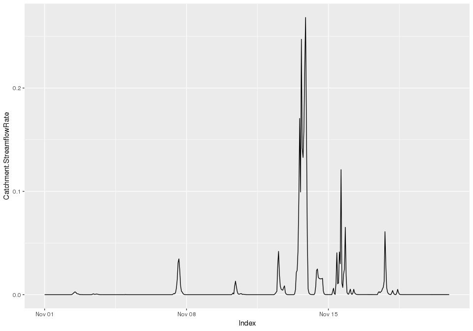
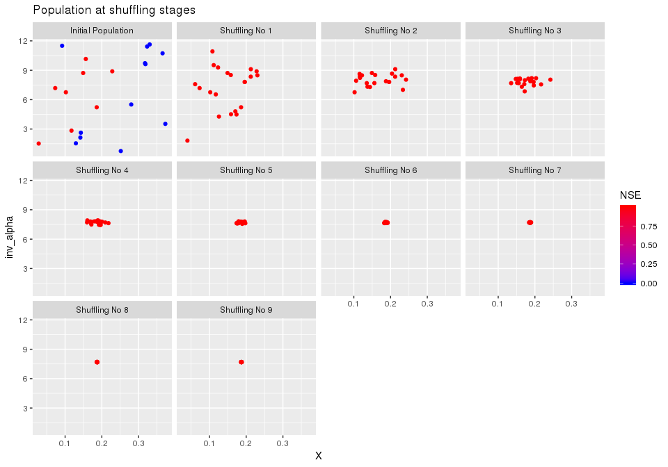
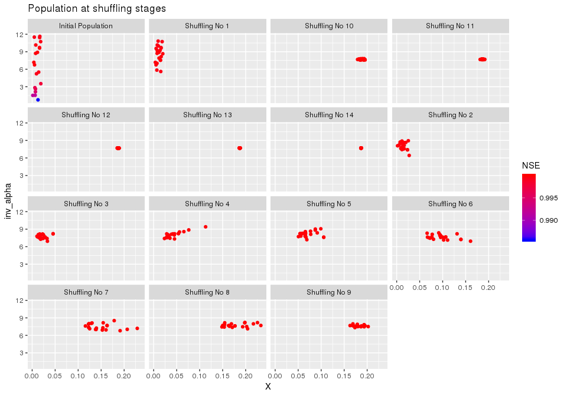
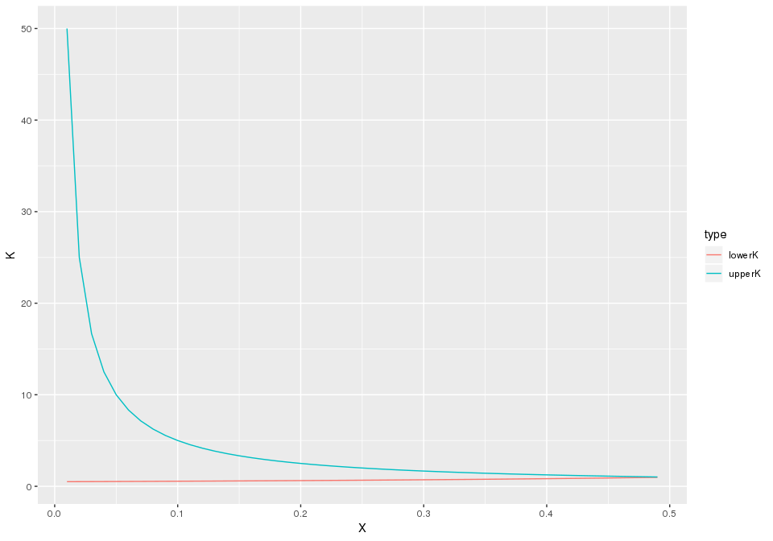
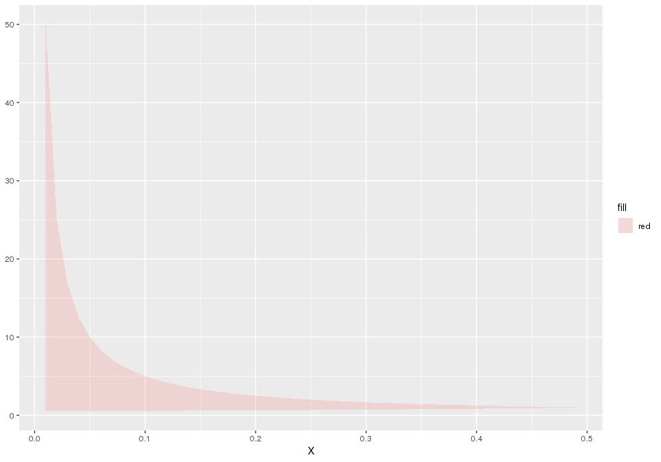
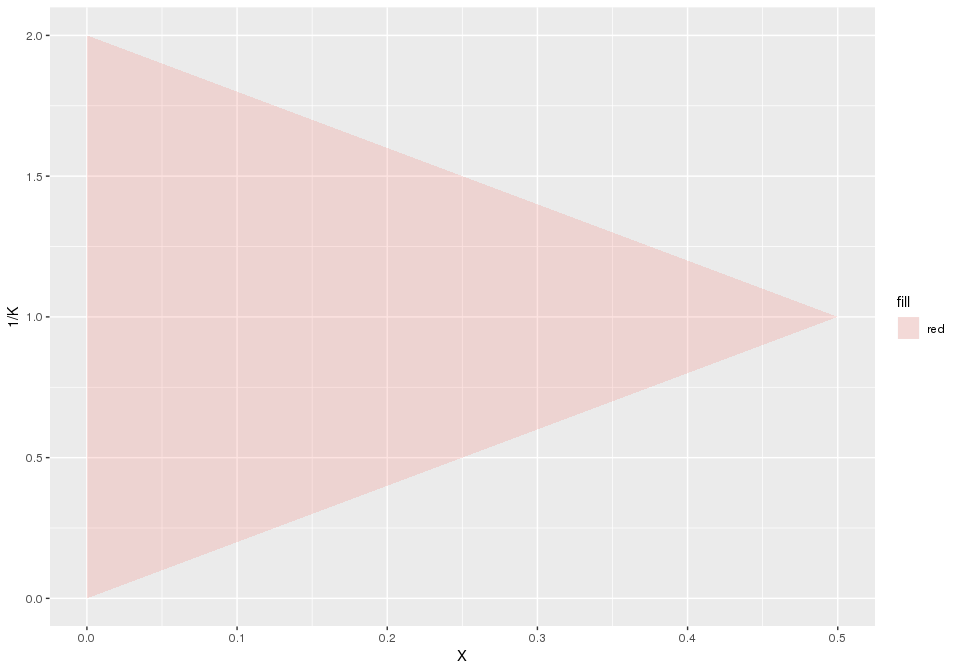
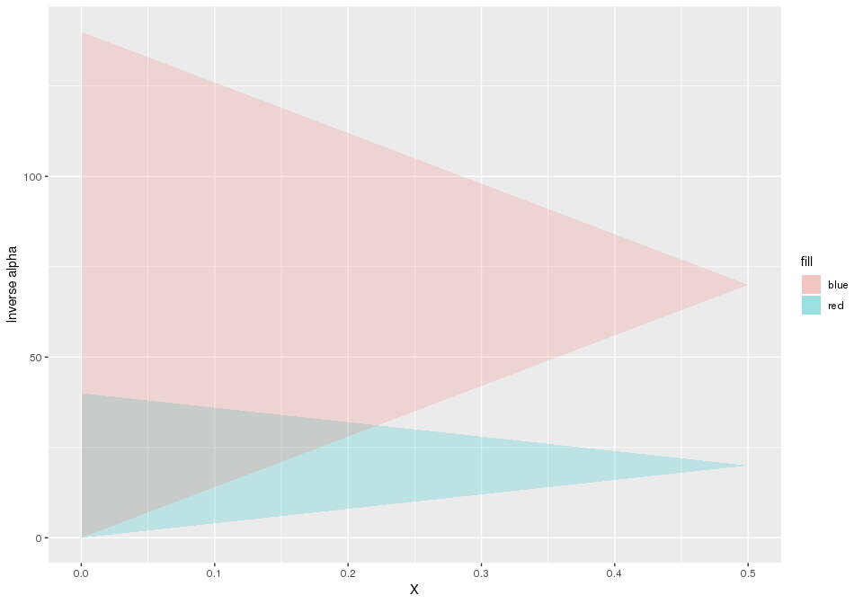
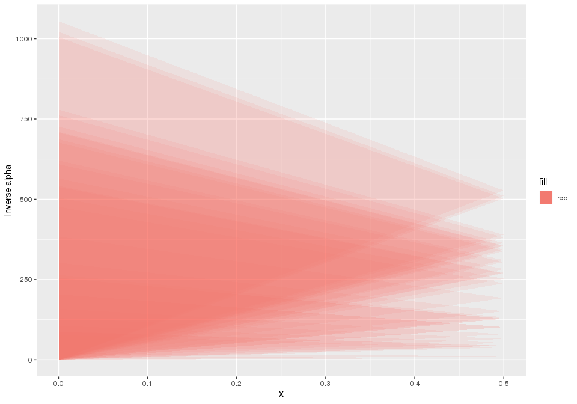
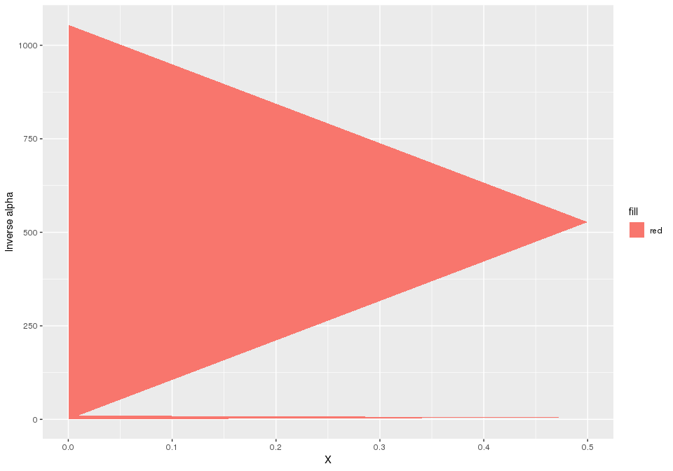
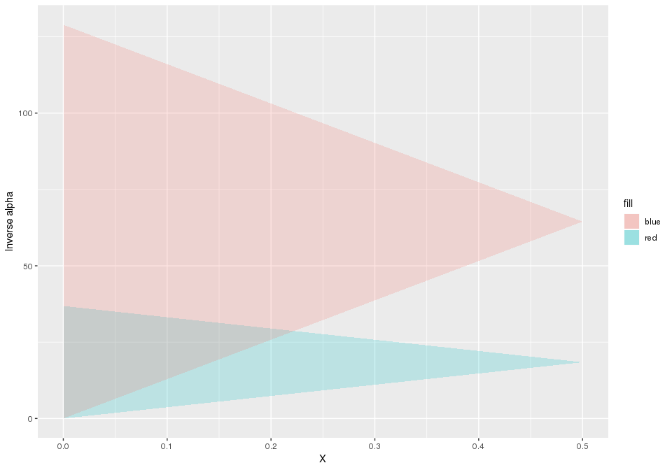

Linear Muskingum channel routing model - constrained subcatchment calibration
================
Jean-Michel Perraud
2019-03-19

Linear Muskingum channel routing model - constrained subcatchment calibration
=============================================================================

Purpose
=======

This vignette focuses on explaining how to calibrate the linear version of Muskingum jointly across river reaches, respecting stability constraints across all these reaches. The second part of the document is an indepth explanation of the scheme that is also used as a reference for unit testing swift.

Guidelines for global calibration of Muskingum constrainted parameters
======================================================================

``` r
library(ggplot2)
library(tidyr)
library(dplyr)
library(readr)
library(swift)
library(mhplot)
library(DiagrammeR)
```

For this example we will use data derived from the South Esk catchment in Tasmania.

We load and configure the model simulation in the next section, without detailed explanation; please read other introductory vignettes if this is unclear.

``` r
modelId <- 'GR4J'
siteId <- 'South_Esk'
simulation <- sampleCatchmentModel(siteId=siteId, configId='catchment')
simulation <- swapModel(simulation, 'MuskingumNonLinear', 'channel_routing')

# # revert back to derfautl values as expected from sample simulation..
# sc <- 1 # reach slope in m/m
# n <- 1  # default Manning's parameter value for the reach
# f <- 1  # "Fudge factor" to allow for a different range of Alpha values. 
# oneHour <- 1
# delt <- oneHour

seClimate <- sampleSeries(siteId=siteId, varName='climate')
seFlows <- sampleSeries(siteId=siteId, varName='flow')

playInput(simulation, seClimate)
setSimulationSpan(simulation, start(seClimate), end(seClimate))
setSimulationTimeStep(simulation, 'hourly')
configureHourlyGr4j(simulation)
```

We can get a topologic view of the model setup (albeit crowded as this is a fairly large catchment.

``` r
DiagrammeR(GetCatchmentDOTGraph_R(simulation))
```

<!--html_preserve-->

<script type="application/json" data-for="htmlwidget-07096207bc20e199bc8b">{"x":{"diagram":"graph TD;1_s(Subarea_1)-->1_l(Subarea_1);2_s(Subarea_2)-->2_l(Subarea_2);3_s(Subarea_3)-->3_l(Subarea_3);4_s(Subarea_4)-->4_l(Subarea_4);5_s(Subarea_5)-->5_l(Subarea_5);6_s(Subarea_6)-->6_l(Subarea_6);7_s(Subarea_7)-->7_l(Subarea_7);8_s(Subarea_8)-->8_l(Subarea_8);9_s(Subarea_9)-->9_l(Subarea_9);10_s(Subarea_10)-->10_l(Subarea_10);11_s(Subarea_11)-->11_l(Subarea_11);12_s(Subarea_12)-->12_l(Subarea_12);13_s(Subarea_13)-->13_l(Subarea_13);14_s(Subarea_14)-->14_l(Subarea_14);15_s(Subarea_15)-->15_l(Subarea_15);16_s(Subarea_16)-->16_l(Subarea_16);17_s(Subarea_17)-->17_l(Subarea_17);18_s(Subarea_18)-->18_l(Subarea_18);19_s(Subarea_19)-->19_l(Subarea_19);20_s(Subarea_20)-->20_l(Subarea_20);21_s(Subarea_21)-->21_l(Subarea_21);22_s(Subarea_22)-->22_l(Subarea_22);23_s(Subarea_23)-->23_l(Subarea_23);24_s(Subarea_24)-->24_l(Subarea_24);25_s(Subarea_25)-->25_l(Subarea_25);26_s(Subarea_26)-->26_l(Subarea_26);27_s(Subarea_27)-->27_l(Subarea_27);28_s(Subarea_28)-->28_l(Subarea_28);29_s(Subarea_29)-->29_l(Subarea_29);30_s(Subarea_30)-->30_l(Subarea_30);31_s(Subarea_31)-->31_l(Subarea_31);32_s(Subarea_32)-->32_l(Subarea_32);33_s(Subarea_33)-->33_l(Subarea_33);34_s(Subarea_34)-->34_l(Subarea_34);35_s(Subarea_35)-->35_l(Subarea_35);36_s(Subarea_36)-->36_l(Subarea_36);37_s(Subarea_37)-->37_l(Subarea_37);38_s(Subarea_38)-->38_l(Subarea_38);39_s(Subarea_39)-->39_l(Subarea_39);40_s(Subarea_40)-->40_l(Subarea_40);41_s(Subarea_41)-->41_l(Subarea_41);42_s(Subarea_42)-->42_l(Subarea_42);\n1_n[Node_1]-->1_l;1_l-->2_n[Node_2];2_n[Node_2]-->2_l;2_l-->5_n[Node_5];3_n[Node_3]-->3_l;3_l-->4_n[Node_4];4_n[Node_4]-->4_l;4_l-->5_n[Node_5];5_n[Node_5]-->5_l;5_l-->7_n[Node_7];6_n[Node_6]-->6_l;6_l-->7_n[Node_7];7_n[Node_7]-->7_l;7_l-->8_n[Node_8];8_n[Node_8]-->8_l;8_l-->9_n[Node_9];9_n[Node_9]-->9_l;9_l-->13_n[Node_13];10_n[Node_10]-->10_l;10_l-->11_n[Node_11];11_n[Node_11]-->11_l;11_l-->12_n[Node_12];12_n[Node_12]-->12_l;12_l-->13_n[Node_13];13_n[Node_13]-->13_l;13_l-->14_n[Node_14];14_n[Node_14]-->14_l;14_l-->15_n[Node_15];15_n[Node_15]-->15_l;15_l-->16_n[Node_16];16_n[Node_16]-->16_l;16_l-->18_n[Node_18];17_n[Node_17]-->17_l;17_l-->18_n[Node_18];18_n[Node_18]-->18_l;18_l-->26_n[Node_26];19_n[Node_19]-->19_l;19_l-->20_n[Node_20];20_n[Node_20]-->20_l;20_l-->21_n[Node_21];21_n[Node_21]-->21_l;21_l-->22_n[Node_22];22_n[Node_22]-->22_l;22_l-->23_n[Node_23];23_n[Node_23]-->23_l;23_l-->24_n[Node_24];24_n[Node_24]-->24_l;24_l-->25_n[Node_25];25_n[Node_25]-->25_l;25_l-->26_n[Node_26];26_n[Node_26]-->26_l;26_l-->29_n[Node_29];27_n[Node_27]-->27_l;27_l-->28_n[Node_28];28_n[Node_28]-->28_l;28_l-->29_n[Node_29];29_n[Node_29]-->29_l;29_l-->30_n[Node_30];30_n[Node_30]-->30_l;30_l-->34_n[Node_34];31_n[Node_31]-->31_l;31_l-->32_n[Node_32];32_n[Node_32]-->32_l;32_l-->33_n[Node_33];33_n[Node_33]-->33_l;33_l-->34_n[Node_34];34_n[Node_34]-->34_l;34_l-->35_n[Node_35];35_n[Node_35]-->35_l;35_l-->36_n[Node_36];36_n[Node_36]-->36_l;36_l-->41_n[Node_41];37_n[Node_37]-->37_l;37_l-->38_n[Node_38];38_n[Node_38]-->38_l;38_l-->39_n[Node_39];39_n[Node_39]-->39_l;39_l-->40_n[Node_40];40_n[Node_40]-->40_l;40_l-->41_n[Node_41];41_n[Node_41]-->41_l;41_l-->42_n[Node_42];42_n[Node_42]-->42_l;42_l-->43_n[Outlet];\nstyle 1_s fill : #A2EB86 ;style 2_s fill : #A2EB86 ;style 3_s fill : #A2EB86 ;style 4_s fill : #A2EB86 ;style 5_s fill : #A2EB86 ;style 6_s fill : #A2EB86 ;style 7_s fill : #A2EB86 ;style 8_s fill : #A2EB86 ;style 9_s fill : #A2EB86 ;style 10_s fill : #A2EB86 ;style 11_s fill : #A2EB86 ;style 12_s fill : #A2EB86 ;style 13_s fill : #A2EB86 ;style 14_s fill : #A2EB86 ;style 15_s fill : #A2EB86 ;style 16_s fill : #A2EB86 ;style 17_s fill : #A2EB86 ;style 18_s fill : #A2EB86 ;style 19_s fill : #A2EB86 ;style 20_s fill : #A2EB86 ;style 21_s fill : #A2EB86 ;style 22_s fill : #A2EB86 ;style 23_s fill : #A2EB86 ;style 24_s fill : #A2EB86 ;style 25_s fill : #A2EB86 ;style 26_s fill : #A2EB86 ;style 27_s fill : #A2EB86 ;style 28_s fill : #A2EB86 ;style 29_s fill : #A2EB86 ;style 30_s fill : #A2EB86 ;style 31_s fill : #A2EB86 ;style 32_s fill : #A2EB86 ;style 33_s fill : #A2EB86 ;style 34_s fill : #A2EB86 ;style 35_s fill : #A2EB86 ;style 36_s fill : #A2EB86 ;style 37_s fill : #A2EB86 ;style 38_s fill : #A2EB86 ;style 39_s fill : #A2EB86 ;style 40_s fill : #A2EB86 ;style 41_s fill : #A2EB86 ;style 42_s fill : #A2EB86 ;\nstyle 1_l fill : #FFF289 ;style 2_l fill : #FFF289 ;style 3_l fill : #FFF289 ;style 4_l fill : #FFF289 ;style 5_l fill : #FFF289 ;style 6_l fill : #FFF289 ;style 7_l fill : #FFF289 ;style 8_l fill : #FFF289 ;style 9_l fill : #FFF289 ;style 10_l fill : #FFF289 ;style 11_l fill : #FFF289 ;style 12_l fill : #FFF289 ;style 13_l fill : #FFF289 ;style 14_l fill : #FFF289 ;style 15_l fill : #FFF289 ;style 16_l fill : #FFF289 ;style 17_l fill : #FFF289 ;style 18_l fill : #FFF289 ;style 19_l fill : #FFF289 ;style 20_l fill : #FFF289 ;style 21_l fill : #FFF289 ;style 22_l fill : #FFF289 ;style 23_l fill : #FFF289 ;style 24_l fill : #FFF289 ;style 25_l fill : #FFF289 ;style 26_l fill : #FFF289 ;style 27_l fill : #FFF289 ;style 28_l fill : #FFF289 ;style 29_l fill : #FFF289 ;style 30_l fill : #FFF289 ;style 31_l fill : #FFF289 ;style 32_l fill : #FFF289 ;style 33_l fill : #FFF289 ;style 34_l fill : #FFF289 ;style 35_l fill : #FFF289 ;style 36_l fill : #FFF289 ;style 37_l fill : #FFF289 ;style 38_l fill : #FFF289 ;style 39_l fill : #FFF289 ;style 40_l fill : #FFF289 ;style 41_l fill : #FFF289 ;style 42_l fill : #FFF289 ;\nstyle 1_n fill : #FFA070 ;style 2_n fill : #FFA070 ;style 3_n fill : #FFA070 ;style 4_n fill : #FFA070 ;style 5_n fill : #FFA070 ;style 6_n fill : #FFA070 ;style 7_n fill : #FFA070 ;style 8_n fill : #FFA070 ;style 9_n fill : #FFA070 ;style 10_n fill : #FFA070 ;style 11_n fill : #FFA070 ;style 12_n fill : #FFA070 ;style 13_n fill : #FFA070 ;style 14_n fill : #FFA070 ;style 15_n fill : #FFA070 ;style 16_n fill : #FFA070 ;style 17_n fill : #FFA070 ;style 18_n fill : #FFA070 ;style 19_n fill : #FFA070 ;style 20_n fill : #FFA070 ;style 21_n fill : #FFA070 ;style 22_n fill : #FFA070 ;style 23_n fill : #FFA070 ;style 24_n fill : #FFA070 ;style 25_n fill : #FFA070 ;style 26_n fill : #FFA070 ;style 27_n fill : #FFA070 ;style 28_n fill : #FFA070 ;style 29_n fill : #FFA070 ;style 30_n fill : #FFA070 ;style 31_n fill : #FFA070 ;style 32_n fill : #FFA070 ;style 33_n fill : #FFA070 ;style 34_n fill : #FFA070 ;style 35_n fill : #FFA070 ;style 36_n fill : #FFA070 ;style 37_n fill : #FFA070 ;style 38_n fill : #FFA070 ;style 39_n fill : #FFA070 ;style 40_n fill : #FFA070 ;style 41_n fill : #FFA070 ;style 42_n fill : #FFA070 ;style 43_n fill : #FFA070 ;"},"evals":[],"jsHooks":[]}</script>
<!--/html_preserve-->
We cookie cut to get a subcatchment near the headwaters.

``` r
subsim <- subsetCatchment(simulation, 'node.5')
DiagrammeR(GetCatchmentDOTGraph_R(subsim))
```

<!--html_preserve-->

<script type="application/json" data-for="htmlwidget-cfa29d27ed8efda7e987">{"x":{"diagram":"graph TD;1_s(Subarea_1)-->1_l(Subarea_1);2_s(Subarea_2)-->2_l(Subarea_2);3_s(Subarea_3)-->3_l(Subarea_3);4_s(Subarea_4)-->4_l(Subarea_4);\n2_n[Node_2]-->2_l;2_l-->5_n[Node_5];1_n[Node_1]-->1_l;1_l-->2_n[Node_2];4_n[Node_4]-->4_l;4_l-->5_n[Node_5];3_n[Node_3]-->3_l;3_l-->4_n[Node_4];\nstyle 1_s fill : #A2EB86 ;style 2_s fill : #A2EB86 ;style 3_s fill : #A2EB86 ;style 4_s fill : #A2EB86 ;\nstyle 2_l fill : #FFF289 ;style 1_l fill : #FFF289 ;style 4_l fill : #FFF289 ;style 3_l fill : #FFF289 ;\nstyle 5_n fill : #FFA070 ;style 2_n fill : #FFA070 ;style 1_n fill : #FFA070 ;style 4_n fill : #FFA070 ;style 3_n fill : #FFA070 ;"},"evals":[],"jsHooks":[]}</script>
<!--/html_preserve-->
We configure the routing scheme to be linear (parameter N set and fixed to 1)

``` r
linkIds <- mkFullDataId('link', getLinkIds(subsim))
setStateValue(subsim, mkFullDataId(linkIds, 'N'), rep(1.0, length(linkIds)))
```

Let's have a look at the link properties and other default routing parameters

``` r
lnkpnames <- c('Length', 'f', 'ManningsN', 'Slope', 'N', 'X', 'Alpha')
getStateValue(subsim,mkFullDataId('link.1', lnkpnames))
```

    ##    link.1.Length         link.1.f link.1.ManningsN     link.1.Slope 
    ##     6.140000e+03     1.000000e+00     1.000000e+00     1.000000e+00 
    ##         link.1.N         link.1.X     link.1.Alpha 
    ##     1.000000e+00    4.651218e-310    2.223295e-322

X is between 0 and 0.5, without stability constraints. Setting a default Alpha is... trickier.

``` r
setStateValue(subsim, mkFullDataId(linkIds, 'X'), rep(1e-6, length(linkIds)))
setStateValue(subsim, mkFullDataId(linkIds, 'Alpha'), rep(0.0005, length(linkIds)))
```

If we look at the subcatchment outflow in this configuration, it is a series of unfeasible values - at least one link was in an unfeasible zone for (Alpha, X)

``` r
varId <- 'Catchment.StreamflowRate'
catOutflowId <- 'subarea.1.OutflowRate'

recordState(subsim,varId)
recordState(subsim,catOutflowId)

execSimulation(subsim)
someFlow <- getRecorded(subsim, varId)
summary(someFlow)
```

    ##      Index                     Catchment.StreamflowRate
    ##  Min.   :2010-11-01 00:00:00   Min.   :-19998          
    ##  1st Qu.:2010-11-05 23:45:00   1st Qu.:-19998          
    ##  Median :2010-11-10 23:30:00   Median :-19998          
    ##  Mean   :2010-11-10 23:30:00   Mean   :-19998          
    ##  3rd Qu.:2010-11-15 23:15:00   3rd Qu.:-19998          
    ##  Max.   :2010-11-20 23:00:00   Max.   :-19998

We can double-check that the subarea does produce runoff yield; the links are where the model does not work yet.

``` r
summary(getRecorded(subsim, catOutflowId))
```

    ##      Index                     subarea.1.OutflowRate
    ##  Min.   :2010-11-01 00:00:00   Min.   :0.000e+00    
    ##  1st Qu.:2010-11-05 23:45:00   1st Qu.:5.000e-08    
    ##  Median :2010-11-10 23:30:00   Median :8.170e-07    
    ##  Mean   :2010-11-10 23:30:00   Mean   :7.353e-04    
    ##  3rd Qu.:2010-11-15 23:15:00   3rd Qu.:8.327e-06    
    ##  Max.   :2010-11-20 23:00:00   Max.   :1.701e-02

So, given that each routing link parameters Alpha and X are subject to constraint that vary depending on 'Length', 'f', 'ManningsN', 'Slope', how do we get a pair (Alpha, X) that globaly respect these constraints? This is not complex science but complicated enough to get wrong.

'swift' offers facilities to remove the error prone tedium. First, `feasibleMuskingumBounds` lists the extremas of the feasible (Alpha, X) parameter space.

``` r
(akbounds <- swift::feasibleMuskingumBounds(subsim, 1))
```

    ##       min_alpha           max_x alpha_for_max_x 
    ##      0.08143322      0.37382040      0.13004771

The numbers above can play a *crucial* role when setting up an optimizer for this model; more on this soon.

``` r
oneHour <- 1

pSpecMusk <- data.frame(
  Name = c('X', 'Alpha'),
  Value = c( akbounds['max_x'] / 2, akbounds['alpha_for_max_x']),
  Min= c(1.0E-06, akbounds['min_alpha']),   
  Max = c(akbounds['max_x'], 1e5), 
  stringsAsFactors=FALSE
)

# Basic parameterizer
pzm <- function(simulation, pSpecs=pSpecMusk) {
  akbounds <- swift::feasibleMuskingumBounds(simulation, 1)
  p_musk <- createParameterizer('generic links',pSpecs);
  p_musk
}

# Wrapper parameterizer, with constraints added around.
pzc <- function(simulation, pSpecs=pSpecMusk) {
  p_musk <- pzm(simulation, pSpecs)
  p_musk_c <- createMuskingumParamConstraints(p_musk, deltaT=oneHour, "Alpha", "X", simulation)
  p_musk_c
}


pp <- parameterizerAsDataFrame
```

``` r
pp(pzm(subsim))
```

    ##    Name        Min          Max     Value
    ## 1     X 0.00000100 3.738204e-01 0.1869102
    ## 2 Alpha 0.08143322 1.000000e+05 0.1300477

``` r
p <- pzc(subsim)
pp(p)
```

    ##    Name       Min       Max     Value
    ## 1     X 0.0000010 0.3738204 0.1869102
    ## 2 Alpha 0.1001528 0.2600954 0.1300477

Let's get a trace of the subcatchment outflow, as a synthetic data to calibrated against.

``` r
applySysConfig(p, subsim)
execSimulation(subsim)
someFlow <- getRecorded(subsim, varId)
summary(someFlow)
```

    ##      Index                     Catchment.StreamflowRate
    ##  Min.   :2010-11-01 00:00:00   Min.   :0.000e+00       
    ##  1st Qu.:2010-11-05 23:45:00   1st Qu.:8.700e-07       
    ##  Median :2010-11-10 23:30:00   Median :8.688e-05       
    ##  Mean   :2010-11-10 23:30:00   Mean   :6.165e-03       
    ##  3rd Qu.:2010-11-15 23:15:00   3rd Qu.:6.350e-04       
    ##  Max.   :2010-11-20 23:00:00   Max.   :2.683e-01

We do now get a valid outflow since (Alpha-K) respects feasibility constraints on all links.

``` r
autoplot(someFlow)
```



Setting up calibration
----------------------

``` r
pSpecMaxBounds <- data.frame(
  Name =  c('X',     'Alpha'),
  Value = c(1.0E-6, akbounds['alpha_for_max_x']), # IMPORTANT to use these values.
  Min=    c(1.0E-6, akbounds['min_alpha']),   
  Max =   c(akbounds['max_x'], 1e6), # Alpha_max can get very large. 
  stringsAsFactors=FALSE
)

pp(pzc(subsim, pSpecMaxBounds))
```

    ##    Name        Min          Max     Value
    ## 1     X 0.00000100 3.738204e-01 0.0000010
    ## 2 Alpha 0.08143331 4.861449e+04 0.1300477

If we were to use another (X, Alpha) point e.g. X=0.1869102, the feasible bounds for Alpha change drastically. If an optimizer samples this for an initial population of points (SCE), this is unnecessarily restrictive for Alpha. Many hydrological calibration schemes were designed without consideration on feasible space that are not hypercubes.

``` r
pp(pzc(subsim, pSpecMusk))
```

    ##    Name       Min       Max     Value
    ## 1     X 0.0000010 0.3738204 0.1869102
    ## 2 Alpha 0.1001528 0.2600954 0.1300477

While calibrating in the (Alpha,X) space is possible, perhaps preferable in some cases, (1/Alpha,X) has a triangular shaped feasibility region that may be easier to handle for optimizers that work with geometric transformation in the parameter space (SCE). Swift can add this on top of the constrained calibration:

``` r
# (X, 1/Alpha) parametrizer with dynamically constrained min/max bounds.
pzer_inv <- function(simulation, pSpecs=pSpecMusk) {
  p_musk_c <- pzc(simulation, pSpecs)
  p_musk_inv_a <- wrapTransform(p_musk_c)
  addTransform(p_musk_inv_a, 'inv_alpha', 'Alpha', '1/x')
  p_musk_inv_a
}

p <- pzer_inv(subsim, pSpecMaxBounds)
pp(p)
```

    ##        Name       Min        Max    Value
    ## 1 inv_alpha 2.057e-05 12.2799877 7.689486
    ## 2         X 1.000e-06  0.3738204 0.000001

We check that backtransforming to (Alpha-X) works:

``` r
pp(backtransform(p))
```

    ##    Name        Min          Max     Value
    ## 1     X 0.00000100 3.738204e-01 0.0000010
    ## 2 Alpha 0.08143331 4.861449e+04 0.1300477

``` r
objectiveId <- 'NSE'
objective <- createObjective(subsim, varId, observation=someFlow, objectiveId, start(someFlow), end(someFlow))
```

``` r
score <- getScore(objective,p)  
score
```

    ## $scores
    ##       NSE 
    ## 0.9997748 
    ## 
    ## $sysconfig
    ##        Name       Min        Max    Value
    ## 1 inv_alpha 2.057e-05 12.2799877 7.689486
    ## 2         X 1.000e-06  0.3738204 0.000001

``` r
#termination <- swift::CreateSceMaxRuntimeTerminationWila_R(1/60)
termination <- swift::CreateSceTerminationWila_Pkg_R('relative standard deviation', c('0.001','0.0167'))
sceParams <- getDefaultSceParameters()
npars <- 2
sceParams <- SCEParameters(npars)
optimizer <- createSceOptimSwift(objective,terminationCriterion = termination, populationInitializer = p,SCEpars = sceParams)
calibLogger <- setCalibrationLogger(optimizer,"dummy")

optimStartTime <- lubridate::now();
calibResults <- executeOptimization(optimizer)
optimEndTime <- lubridate::now();
optimWallClock <- lubridate::as.duration(lubridate::interval(optimStartTime, optimEndTime))

optimWallClock
```

    ## [1] "1.38240647315979s"

``` r
optLog <- extractOptimizationLog(optimizer, fitnessName = "NSE")
geomOps <- optLog$geomOps 

shuffleLogs <- mhplot::subsetByCategory(optLog$data, pattern = "Initial.*|Shuffling.*") 
mhplot::plotShuffles(shuffleLogs, 'X', 'inv_alpha', objLims = (0:1))
```



``` r
sortedResults <- sortByScore(calibResults, 'NSE')
head(scoresAsDataFrame(sortedResults))
```

    ##   NSE inv_alpha         X
    ## 1   1  7.688320 0.1871205
    ## 2   1  7.687345 0.1867482
    ## 3   1  7.686741 0.1869934
    ## 4   1  7.693171 0.1868937
    ## 5   1  7.693687 0.1868359
    ## 6   1  7.693877 0.1869150

``` r
q <- getBestScore(calibResults, 'NSE', FALSE)
q <- GetSystemConfigurationWila_R(q)
pp(q)
```

    ##        Name      Min       Max     Value
    ## 1 inv_alpha 3.849069 9.9821603 7.6883204
    ## 2         X 0.000001 0.3737638 0.1871205

``` r
pp(backtransform(q))
```

    ##    Name       Min       Max     Value
    ## 1     X 0.0000010 0.3737638 0.1871205
    ## 2 Alpha 0.1001787 0.2598031 0.1300674

Seeding the optimisation point population with restrictive constraint bounds
----------------------------------------------------------------------------

This section is a *counter-example*. Do not do this.

Say, instead of seeding with alpha set to alpha\_for\_x\_max (0.37382040) we instead use a value cloase to its global minimum, 0.083:

``` r
pSpecRestrictiveBounds <- pSpecMaxBounds
pSpecRestrictiveBounds$Value[2] <- 0.083
pSpecRestrictiveBounds
```

    ##                  Name   Value        Min          Max
    ##                     X 1.0e-06 0.00000100 3.738204e-01
    ## alpha_for_max_x Alpha 8.3e-02 0.08143322 1.000000e+06

``` r
p <- pzer_inv(subsim, pSpecRestrictiveBounds)
pp(p)
```

    ##        Name       Min         Max     Value
    ## 1 inv_alpha 2.057e-05 12.27998772 12.048193
    ## 2         X 1.000e-06  0.01887681  0.000001

X is now much more constrained in its feasible range, and initializing a population fails to cover large sections of the feasible triangle. If used in the optimizer (uniform random sampling)

``` r
termination <- swift::CreateSceTerminationWila_Pkg_R('relative standard deviation', c('0.001','0.0167'))
sceParams <- getDefaultSceParameters()
npars <- 2
sceParams <- SCEParameters(npars)
optimizer <- createSceOptimSwift(objective,terminationCriterion = termination, populationInitializer = p,SCEpars = sceParams)
calibLogger <- setCalibrationLogger(optimizer,"dummy")
calibResults <- executeOptimization(optimizer)
```

``` r
library(mhplot)
optLog <- extractOptimizationLog(optimizer, fitnessName = "NSE")
geomOps <- optLog$geomOps 

shuffleLogs <- mhplot::subsetByCategory(optLog$data, pattern = "Initial.*|Shuffling.*") 
mhplot::plotShuffles(shuffleLogs, 'X', 'inv_alpha', objLims = (0:1))
```

 SCE does manage to converge towards the optimum, but it takes a larger number of iterations. Anecdotally, we observed cases where the calibration does fail to go near the optimum, when interplaying with a convergence criterion configured for "leniency".

Detailed explanation and unit test design
=========================================

Default values for properties defining the relationship between Alpha and K (Muskingum-Cunge?)

``` r
L_d <- 1000 # reach lengh in metres
sc_d <- 1e-2 # reach slope in m/m
n_d <- 1  # default Manning's parameter value for the reach
f_d <- 1  # "Fudge factor" to allow for a different range of Alpha values. 
alpha_d <- 0.2  # Alpha parameter from which K is derived along with reach properties
X_d <- 0.3  # attenuation (weighting) factor
oneHour <- 1
K_d <- 2.0  
```

For the case of a linear sub-case (exponent N=1.0 in the storage/outflow relationship) we can analytically solve the system of storage-outflow relationships and get C1, C2, C3, coefficients

``` r
getDenom <- function(K, X, delta_t=oneHour) {
  (2*K*(1-X) + delta_t)
}

getC1 <- function(K, X, delta_t=oneHour) {
  (delta_t - 2*K*X) / getDenom(K, X, delta_t)
}

getC2 <- function(K, X, delta_t=oneHour) {
  (delta_t + 2*K*X) / getDenom(K, X, delta_t)
}

getC3 <- function(K, X, delta_t=oneHour) {
  (2*K*(1-X) - delta_t) / getDenom(K, X, delta_t)
}

linearMuskingum <- function(inflow, prevOutflow=0, prevInflow=0, K=oneHour, X=0.5) {
  getC1(K,X)*inflow + getC2(K,X)*prevInflow + getC3(K,X)*prevOutflow
}
```

We define functions that relate K, alpha and other reach properties, that we will use later for plotting feasible bounds.

``` r
# Gets the factor G in the relationship K = G * Alpha
getKNoAlpha <- function(f=f_d, n=n_d, sc=sc_d, L=L_d) {
  f * n * (L/1000) / sqrt(sc)  # NOTE: (L/1000 to match the swift implementation)
}

# relationship K = G * Alpha
getK <- function(alpha=alpha_d, f=f_d, n=n_d, sc=sc_d, L=L_d) {
  alpha * getKNoAlpha(f=f, n=n, sc=sc, L=L) 
}

# relationship Alpha = K / F
getAlpha <- function(K=K_d, f=f_d, n=n_d, sc=sc_d, L=L_d) {
  K / getKNoAlpha(f=f, n=n, sc=sc, L=L)
}

# relationship 1/Alpha = G / K
getInvAlpha <- function(K=K_d, f=f_d, n=n_d, sc=sc_d, L=L_d) {
  1 / getAlpha(K=K, f=f, n=n, sc=sc, L=L)
}
```

Constraints on the Linear (N=1) case of Muskingum parameters
============================================================

It can be shown that given the following constraints must be satisfied to be in a stability zone (no negative outflows):

-   K &lt; delta\_t / (2 \* X)
-   K &gt; delta\_t / (2 \* (1 - X))

We can derive the following functions defining the feasible boundaries for the triplet X, K, delta\_t, (and Alpha by proxy from K).

``` r
upperKValue <- function(X, delta_t=oneHour) {
  delta_t / (2*X)
}

lowerKValue <- function(X, delta_t=oneHour) {
  delta_t / (2*(1-X))
}

upperInvKValue <- function(X, delta_t=oneHour) {
  (2*(1-X)) / delta_t
}

lowerInvKValue <- function(X, delta_t=oneHour) {
  2*X / delta_t
}

upperXValue <- function(K, delta_t=oneHour) {
  min( 1 - delta_t / (2*K) , delta_t / (2*K) )
}

upperXValueFromAlpha <- function(alpha=alpha_d, f=f_d, n=n_d, sc=sc_d, L=L_d, delta_t=oneHour) {
  upperXValue(getK(alpha = alpha, f=f, n=n, sc=sc, L=L), delta_t=delta_t)
}

getFeasibleKInterval <- function(X=X_d, delta_t=oneHour) {
  c(lowerKValue(X, delta_t), upperKValue(X, delta_t))
}

getFeasibleAlphaInterval <- function(f=f_d, n=n_d, sc=sc_d, L=L_d, X=X_d, delta_t=oneHour) {
  G <- getKNoAlpha(f=f, n=n, sc=sc, L=L) 
  # K = G * Alpha
  getFeasibleKInterval(X, delta_t)/G
}

getFeasibleInverseAlphaInterval <- function(f=f_d, n=n_d, sc=sc_d, L=L_d, X=X_d, delta_t=oneHour) {
  rev(1 / getFeasibleAlphaInterval(f, n, sc, L, X, delta_t))
}

getFeasibleTimestepInterval <- function(alpha=alpha_d, f=f_d, n=n_d, sc=sc_d, L=L_d, X=X_d) {
    k <- getK(alpha, f, n, sc, L)
    c(2 * k * X, k)
}
```

Given a delta\_t, plotting the upper and lower K for X:

``` r
Xvals <- seq(from=1e-2, to=0.49999, by=1e-2)

d <- tibble(
    X=Xvals, 
    upperK=upperKValue(Xvals),
    lowerK=lowerKValue(Xvals)
)

df <- d %>% gather(key='type', value='kbound', -X)
g <- ggplot(df, aes(x=X, y = kbound, color=type)) + geom_line() + ylab("K")
g
```



The feasible region is the area between these two curves:

``` r
ggplot(d) + ggplot2::geom_ribbon(ggplot2::aes(x=X, ymin=lowerK, ymax=upperK, fill='red'), alpha=0.2)
```



It is easier to work on the inverse of K on the Y axis, as the bounds become lines. We can also afford to visually go closer to X=0.

``` r
Xvals <- seq(from=1e-4, to=0.5-1e-4, length.out = 100)

d <- tibble(
    X=Xvals, 
    upperK=upperKValue(Xvals),
    lowerK=lowerKValue(Xvals)
)

d_inv_wide <- d %>% 
    transmute(X=X, upperInvK = 1 / lowerK, lowerInvK = 1 / upperK ) 
d_inv <- d_inv_wide %>% 
    gather(key='type', value='kbound', -X)

ggplot(d_inv_wide) + 
  ggplot2::geom_ribbon(ggplot2::aes(x=X, ymin=lowerInvK, ymax=upperInvK, fill='red'), alpha=0.2) +
  ylab("1/K")
```



So if we have two reaches of different lengths (or other properties), we can back transform the feasible Alpha regions for each reach and since since alpha is a linear function of X we visually get the following intersect of feasible regions.

``` r
getAlphaBounds <- function(L, f=f_d, n=n_d, sc=sc_d, delta_t=oneHour) {
  d <- tibble(
      X=Xvals, 
      upperK=upperKValue(Xvals, delta_t),
      lowerK=lowerKValue(Xvals, delta_t)
  )
  
  d_alpha_one <- d %>% 
      transmute(X=X, 
          l_alpha = getAlpha(K=lowerK, f=f, n=n, sc=sc, L=L), 
          u_alpha = getAlpha(K=upperK, f=f, n=n, sc=sc, L=L))
  d_alpha_one
}

inverseAlphaBounds <- function(d_alpha) {
  d_alpha %>% 
    transmute(X=X, u_inv_alpha = 1 / l_alpha, l_inv_alpha = 1 / u_alpha ) 
}

d_alpha_one <- getAlphaBounds(L=2000)
d_alpha_two <- getAlphaBounds(L=7000)

d_inv_alpha_wide_one <- inverseAlphaBounds(d_alpha_one)
d_inv_alpha_wide_two <- inverseAlphaBounds(d_alpha_two)

ggplot() + 
    ggplot2::geom_ribbon(data=d_inv_alpha_wide_one, ggplot2::aes(x=X, ymin=l_inv_alpha, ymax=u_inv_alpha, fill='red'), alpha=0.2) +
    ggplot2::geom_ribbon(data=d_inv_alpha_wide_two, ggplot2::aes(x=X, ymin=l_inv_alpha, ymax=u_inv_alpha, fill='blue'), alpha=0.2) +
    ylab('Inverse alpha')
```



``` r
# See cpp unit test for 
# in MNL algorithm constraint violated if ( (beta > delta_t / (2 * X) || beta < delta_t / (2 * (1 - X))
```

Note that overall X is now constrained to be at most to be below 0.22 and the inverse of alpha from 0 to 12 at most (NOTE: visual shortcoming of previous plot, minimum X should be zero), if both reach are to be kept in their routing stablity zones.

Now consider a region the following set of reach properties:

``` r
library(readr)
# murray_nl <- readr::read_csv('c:/data/stsf/documentation/UpperMurray/node_link.csv')
murray_nl <- readr::read_csv(file.path(swift::sampleDataDir(), 'UpperMurray/node_link.csv'))
```

    ## Parsed with column specification:
    ## cols(
    ##   ID = col_double(),
    ##   Name = col_character(),
    ##   From = col_double(),
    ##   To = col_double(),
    ##   RainST = col_double(),
    ##   EvapST = col_double(),
    ##   Length = col_double(),
    ##   Area = col_double(),
    ##   Slope = col_double(),
    ##   Frac_Urban = col_double(),
    ##   Frac_Forest = col_double(),
    ##   RLF = col_double(),
    ##   Mann_n = col_double()
    ## )

``` r
head(murray_nl)
```

    ## # A tibble: 6 x 13
    ##      ID Name   From    To RainST EvapST Length   Area Slope Frac_Urban
    ##   <dbl> <chr> <dbl> <dbl>  <dbl>  <dbl>  <dbl>  <dbl> <dbl>      <dbl>
    ## 1     1 Suba…     1     2      1      1  36320 2.24e8     1          0
    ## 2     2 Suba…     2     3      2      2  15109 1.75e8     1          0
    ## 3     3 Suba…     3     8      3      3  34340 4.88e8     1          0
    ## 4     4 Suba…     4     5      4      4  51064 4.47e8     1          0
    ## 5     5 Suba…     5     6      5      5  23819 4.37e8     1          0
    ## 6     6 Suba…     6     7      6      6  33835 3.75e8     1          0
    ## # … with 3 more variables: Frac_Forest <dbl>, RLF <dbl>, Mann_n <dbl>

We note that only Length varies across reaches so we will ignore other reach parameters. Let's overlay feasible regions for all reaches:

``` r
getFeasibleAlphaBounds <- function(reach_length) {
  d_inv_alpha <- d %>% 
      transmute(X=X, 
        l_inv_alpha = getInvAlpha(lowerK, L=reach_length), # lower K --> upper invK --> thus upper invAlpha 
        u_inv_alpha = getInvAlpha(upperK, L=reach_length)) 
  d_inv_alpha
}

reach_bounds <- lapply(murray_nl$Length, getFeasibleAlphaBounds)

g = ggplot()
for (b in reach_bounds) {
  g <- g + ggplot2::geom_ribbon(data=b, ggplot2::aes(x=X, ymin=l_inv_alpha, ymax=u_inv_alpha, fill='red'), alpha=0.1)
}
g + ylab('Inverse alpha')
```



It is a bit crowded but you can intuit that the common area is quite small given the large difference in magnitude in the feasible triangles. Indeed, the extrema in reach lengths are two orders of magnitude different:

``` r
(length_range <- range(murray_nl$Length))
```

    ## [1]   502 52731

``` r
g = ggplot()
for (b in lapply(length_range, getFeasibleAlphaBounds)) {
  g <- g + ggplot2::geom_ribbon(data=b, ggplot2::aes(x=X, ymin=l_inv_alpha, ymax=u_inv_alpha, fill='red'), alpha=1)
}
g + ylab('Inverse alpha')
```



Unit test design
================

``` r
sc <- 1.11e-2 # reach slope in m/m
n <- 0.98  # default Manning's parameter value for the reach
f <- 0.99  # "Fudge factor" to allow for a different range of Alpha values. 
oneHour <- 1
delt <- oneHour

length_small <- 2000
length_large <- 7000

d_alpha_one <- getAlphaBounds(L=length_small, f, n, sc, delt)
d_alpha_two <- getAlphaBounds(L=length_large, f, n, sc, delt)

d_inv_alpha_wide_one <- inverseAlphaBounds(d_alpha_one)
d_inv_alpha_wide_two <- inverseAlphaBounds(d_alpha_two)

ggplot() + 
    ggplot2::geom_ribbon(data=d_inv_alpha_wide_one, ggplot2::aes(x=X, ymin=l_inv_alpha, ymax=u_inv_alpha, fill='red'), alpha=0.2) +
    ggplot2::geom_ribbon(data=d_inv_alpha_wide_two, ggplot2::aes(x=X, ymin=l_inv_alpha, ymax=u_inv_alpha, fill='blue'), alpha=0.2) +
    ylab('Inverse alpha')
```



``` r
inv_alpha <- 25
alpha <- 1/inv_alpha  # Alpha parameter from which K is derived along with reach properties
X <- 0.1  # attenuation (weighting) factor

get_bounds <- function(L, X, alpha) {
  alpha_bounds <- getFeasibleAlphaInterval(f, n, sc, L, X, delt)
  inv_alpha_bounds <- getFeasibleInverseAlphaInterval (f, n, sc, L, X, delt)
  up_X <- upperXValueFromAlpha(alpha, f, n, sc, L, delt)
  data_frame(
    l_alpha = alpha_bounds[1],
    u_alpha = alpha_bounds[2],
    l_inv_alpha = inv_alpha_bounds[1],
    u_inv_alpha = inv_alpha_bounds[2],
    u_x = up_X
  )
}
```

Given other link properties are the same but lengths, to get min and max G we only need:

``` r
min_G <- getKNoAlpha(f, n, sc, length_small)
max_G <- getKNoAlpha(f, n, sc, length_large)
(c(min_G, max_G))
```

    ## [1] 18.41746 64.46112

``` r
min_F <- 1/max_G  
max_F <- 1/min_G  
(c(min_F, max_F))
```

    ## [1] 0.01551323 0.05429630

``` r
delta_t <- 1.0

globalMinAlpha <- function(min_G, delta_t){
  delta_t / ( 2 * min_G )
}

alphaForMaxX <- function(min_G, max_G, delta_t) {
  delta_t / 2 * (min_G + max_G) / (min_G * max_G) 
}

absMaxX <- function(min_G, max_G) {
  min_G / (min_G + max_G) 
}


# for unit test in swift\tests\api\parameterizers.cpp
x <- numeric(3)
x[1] <- absMaxX (min_G, max_G)
x[2] <- alphaForMaxX(min_G, max_G, delta_t)
x[3] <- globalMinAlpha(min_G, delta_t)

x
```

    ## [1] 0.22222222 0.03490476 0.02714815

``` r
get_bounds(length_small, X, alpha)
```

    ## # A tibble: 1 x 5
    ##   l_alpha u_alpha l_inv_alpha u_inv_alpha   u_x
    ##     <dbl>   <dbl>       <dbl>       <dbl> <dbl>
    ## 1  0.0302   0.271        3.68        33.2 0.321

``` r
get_bounds(length_large, X, alpha)
```

    ## # A tibble: 1 x 5
    ##   l_alpha u_alpha l_inv_alpha u_inv_alpha   u_x
    ##     <dbl>   <dbl>       <dbl>       <dbl> <dbl>
    ## 1 0.00862  0.0776        12.9        116. 0.194

``` r
overallFeasibleAlpha <- function(X) {
  bounds_len_small <- getFeasibleAlphaInterval(f, n, sc, length_small, X, delta_t)
  bounds_len_large <-getFeasibleAlphaInterval(f, n, sc, length_large, X, delta_t)
  # smallest reach length (rather, smallest G) dictate the lower feasible alpha bound
  # largest reach length (rather, smallest G) dictate the opper feasible alpha bound
  c(bounds_len_small[1], bounds_len_large[2])
}

X <- 0.1
(alphaIntvx1 <- mean(overallFeasibleAlpha(X)))
```

    ## [1] 0.05386538

Lower X to give a larger feasible alpha, to test in swift that user-specified bounds override that.

``` r
X <- 0.05
(alphaIntvx2 <- mean(overallFeasibleAlpha(X)))
```

    ## [1] 0.09185464

``` r
(alphaTest <- (alphaIntvx1 + alphaIntvx2) /2)
```

    ## [1] 0.07286001

``` r
c(
  upperXValueFromAlpha(alphaTest, f, n, sc, length_small),
  upperXValueFromAlpha(alphaTest, f, n, sc, length_large)
)
```

    ## [1] 0.3726070 0.1064591

Non linear version of the routing
=================================

PLACEHOLDER

For N different from 1, we have a case of a non-linear storage-flow relationship.

``` r
inflow = 5
q <- 0:40
```

Storage-outflow relationship:

``` r
sqRelation <- function(q, alpha=alpha_d, f=f_d, n=n_d, sc=sc_d, X=X_d, inflow=0, L=L_d, N=1) {
  getK(alpha=alpha, f=f, n=n, sc=sc, L=L) * (X * q + (1-X)*inflow) ** N 
}

rootEq <- function(q, alpha=alpha_d, f=f_d, n=n_d, sc=sc_d, X=X_d, inflow=0, L=L_d, N=1, dt=3600, prevOutflow=0, prevInflow=0) { 
  sqRelation(q, alpha, f, n, sc, X, inflow, L, N) - (inflow + prevInflow - q - prevOutflow) * dt / 2 
}

derivEq <- function(q, alpha=alpha_d, f=f_d, n=n_d, sc=sc_d, X=X_d, inflow=0, L=L_d, N=1, dt=3600, prevOutflow=0, prevInflow=0) { 
  N*(1-X)*getK(alpha=alpha, f=f, n=n, sc=sc, L=L) * (X * q + (1-X)*inflow) ** (N-1) + dt / 2 
}

n_power = 1.3

qplot(q, sqRelation(q, N=n_power, inflow=inflow), ylab='Storage(m3)', xlab='Outflow (m3/s)') + ggtitle('S = f(Q)')
```

``` r
qplot(q, rootEq(q, N=n_power, inflow=inflow), ylab='Value', xlab='Outflow (m3/s)') + ggtitle('F(Q); root finding')
```

``` r
qplot(q, derivEq(q, N=n_power, inflow=inflow), ylab='Value', xlab='Outflow (m3/s)') + ggtitle('DerivF(Q)')
```

Using a solver to find the root.

``` r
library(rootSolve)
rootFun <- function(z, ...) {rootEq(z, ...)}
uniroot.all(rootFun, c(-10, 60))
```

Given the default values for the parameters or constants in the routing formulation, the following example shows a case where the solution leads to negative outflows:

``` r
nlen <- 100
inflow <- rep(0,nlen)
inflow[4:9] <- c(10,20,15,10,5,3)

routeFlow <- function(rootEqFun, inflow, ...) {
  nlen <- length(inflow)
  outflow <- rep(0,nlen)
  rootEqIndex <- function(z, i) { rootEqFun(z, inflow=inflow[i], prevOutflow=outflow[i-1], prevInflow=inflow[i-1], ...) } 
  for (i in 2:nlen) {
    val <- uniroot.all(function(z) {rootEqIndex(z, i)}, c(0, 60))
    stopifnot(length(val) == 1)
    outflow[i] <- ifelse(length(val) == 1, val, NA)
  }
  outflow
}


routeSeries <- function(inflow, ...) {
  nlen <- length(inflow)
  outflow <- rep(0,nlen)
  routeIndex <- function(i) { linearMuskingum(inflow=inflow[i], prevOutflow=outflow[i-1], prevInflow=inflow[i-1], ...) } 
  for (i in 2:nlen) {
    outflow[i] <- routeIndex(i)
  }
  outflow
}

routeFlow(rootEq, inflow, alpha=0.1, N=1.001)
# q <- seq(from=0.01, to=0.011, length.out=50)
# qplot(, rootEqIndex(q,11), ylab='Value', xlab='Outflow (m3/s)') + ggtitle('DerivF(Q)')
```

``` r
qplot(1:nlen, routeFlow(rootEq, inflow), xlab='time step', ylab='Outflow (m3/s)') + ggtitle('Outflow')
```

Provenance
----------

This document was generated from an R markdown file on 2019-03-19 11:43:45

``` r
sessionInfo()
```

    ## R version 3.5.3 (2019-03-11)
    ## Platform: x86_64-pc-linux-gnu (64-bit)
    ## Running under: Debian GNU/Linux 9 (stretch)
    ## 
    ## Matrix products: default
    ## BLAS: /usr/lib/libblas/libblas.so.3.7.0
    ## LAPACK: /usr/lib/lapack/liblapack.so.3.7.0
    ## 
    ## locale:
    ##  [1] LC_CTYPE=en_AU.UTF-8       LC_NUMERIC=C              
    ##  [3] LC_TIME=en_AU.UTF-8        LC_COLLATE=en_AU.UTF-8    
    ##  [5] LC_MONETARY=en_AU.UTF-8    LC_MESSAGES=en_AU.UTF-8   
    ##  [7] LC_PAPER=en_AU.UTF-8       LC_NAME=C                 
    ##  [9] LC_ADDRESS=C               LC_TELEPHONE=C            
    ## [11] LC_MEASUREMENT=en_AU.UTF-8 LC_IDENTIFICATION=C       
    ## 
    ## attached base packages:
    ## [1] stats     graphics  grDevices utils     datasets  methods   base     
    ## 
    ## other attached packages:
    ##  [1] bindrcpp_0.2.2   DiagrammeR_1.0.0 mhplot_0.5-1     stringr_1.3.1   
    ##  [5] swift_0.8.8      Rcpp_1.0.0       readr_1.3.1      dplyr_0.7.8     
    ##  [9] tidyr_0.8.2      ggplot2_3.1.0    knitr_1.21       rmarkdown_1.11  
    ## 
    ## loaded via a namespace (and not attached):
    ##  [1] lubridate_1.7.4    mvtnorm_1.0-8      lattice_0.20-38   
    ##  [4] visNetwork_2.0.5   msvs_0.3-0         zoo_1.8-4         
    ##  [7] assertthat_0.2.0   digest_0.6.18      utf8_1.1.4        
    ## [10] R6_2.3.0           plyr_1.8.4         evaluate_0.12     
    ## [13] pillar_1.3.1       rlang_0.3.1        lazyeval_0.2.1    
    ## [16] rstudioapi_0.9.0   labeling_0.3       webshot_0.5.1     
    ## [19] downloader_0.4     htmlwidgets_1.3    igraph_1.2.2      
    ## [22] munsell_0.5.0      compiler_3.5.3     influenceR_0.1.0  
    ## [25] rgexf_0.15.3       xfun_0.4           pkgconfig_2.0.2   
    ## [28] htmltools_0.3.6    tidyselect_0.2.5   tibble_2.0.1      
    ## [31] gridExtra_2.3      XML_3.98-1.16      joki_0.4.0        
    ## [34] fansi_0.4.0        viridisLite_0.3.0  crayon_1.3.4      
    ## [37] withr_2.1.2        grid_3.5.3         jsonlite_1.6      
    ## [40] gtable_0.2.0       magrittr_1.5       scales_1.0.0      
    ## [43] cli_1.0.1          stringi_1.2.4      viridis_0.5.1     
    ## [46] brew_1.0-6         xts_0.11-2         RColorBrewer_1.1-2
    ## [49] tools_3.5.3        glue_1.3.0         purrr_0.3.0       
    ## [52] hms_0.4.2          Rook_1.1-1         yaml_2.2.0        
    ## [55] colorspace_1.4-0   cinterop_0.2-5     uchronia_0.4.3    
    ## [58] bindr_0.1.1
